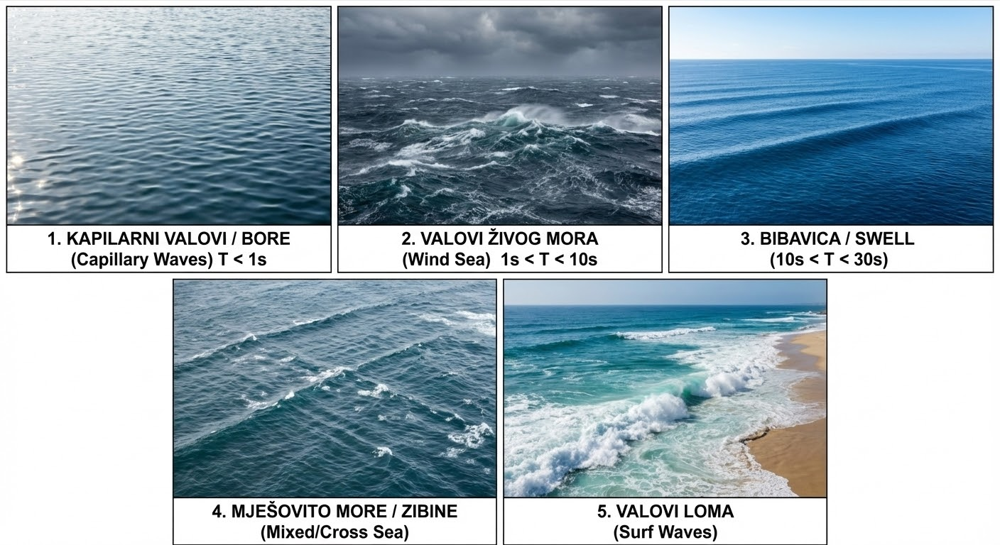

# Morski valovi

## Vrste morskih valova

Gledajući makroskopsku dinamiku oceana, razlikujemo strujanje velikih vodenih masa usmjerenom malom brzinom (morske struje) i lokalna, brza oscilatorna gibanja površinskih slojeva koja nazivamo **morskim valovima (e: *sea waves*)**. Upravo su ovi potonji uzročnici najznačajnijih dinamičkih sila na brodove.

Morski valovi su složen prirodni proces koji se fizički manifestira kao periodičko osciliranje čestica vode. To osciliranje vizualno primjećujemo kao naizmjenično izdizanje i spuštanje **slobodne površine mora (e: *free surface*)** tj. granice između dva medija: morske vode i zraka. Za svaki proces nastanka i širenja valova potrebno je međudjelovanje dviju suprotstavljenih sila:

- **Uzbudne sile (e: *disturbing / exciting forces*):** Sile koje narušavaju ravnotežu i izvode površinu mora iz stanja mirovanja (npr. vjetar, potresi, gravitacija nebeskih tijela, gibanje broda).
- **Povratne ili umirujuće sile (e: *restoring forces*):** Sile koje teže vratiti slobodnu površinu natrag u prvobitno, vodoravno stanje ravnoteže (prvenstveno površinska napetost, sila teža i Coriolisova sila).

Prema dominantnoj uzbudnoj sili i tipičnom valnom periodu (*T*), površinske morske valove možemo podijeliti u sljedeće glavne kategorije (što ujedno čini tzv. spektar morskih valova): **vjetrovni valovi** **(e: *wind-generated waves*)** te **ostali tipovi morskih valova**.

Kao što im ime govori, vjetrovni valovi nastaju uslijed prijenosa energije s vjetra na površinu mora. Dijelimo ih prema fazi razvoja i periodu:

- **Kapilarni valovi (e: *capillary waves*) i bore (e: *ripples*):** (*T* < 1 s) su prvi valovi koji nastaju, kod kojih je glavna povratna sila površinska napetost vode (a ne gravitacija!).
- **Valovi živog mora (e: *wind sea*):** (1 s < *T* < 10 s) su valovi koji se nalaze pod izravnim i aktivnim utjecajem vjetra koji ih je i stvorio. Karakterizira ih velika strmina, izrazita nepravilnost i česta pojava lomljenja krijesta (e: *crest*).
- **Valovi mrtvog mora / bibavica (e: *swell*):** (10 s < *T* < 30 s) su napustili začetni vjetrovni sustav (područje oluje gdje su nastali) ili su ostali nakon što je vjetar prestao puhati. Puno su pravilniji, manjih strmina (gotovo harmonijski) i sadrže ogromnu količinu energije koja se vrlo sporo rasipa. Mogu putovati tisućama kilometara preko oceana prije nego što se razbiju o obalu.
- **Mješovito more / zibine (e: *mixed sea / cross sea*)** sadrži valove živog mora iz jednog smjera i valova mrtvog mora iz drugog smjera, što rezultira izuzetno složenim i opasnim uvjetima za plovidbu.
- **Valovi loma (e: *surf waves*):** Transformacija vjetrovnih valova uslijed smanjenja dubine pri dolasku u obalno područje (plitku vodu).

{#fig-tipovi-vjetrovnih-valova width="80%"}

Ostali tipovi morskih valova su:

- **Brodski valovi (e: *ship waves*):** (0.8 s < *T* < 2 s). Sustav valova generiran samim gibanjem brodskog trupa kroz vodu (pramčani i krmeni valni sustav).
- **Olujni uspori / barički valovi (e: *storm surge*):** (30 s < *T* < 60 min). Dugoperiodična izdizanja razine mora uzrokovana naglim padom tlaka zraka u središtima ciklona te guranjem vodenih masa jakim olujnim vjetrom prema obali.
- **Tsunami (e: *tsunami*):** (5 min < *T* < 60 min). Iznimno dugi i razorni valovi koji nastaju uslijed tektonskih poremećaja (podmorski potresi, vulkanske erupcije, klizišta).
- **Šćige ili seše (e: *seiche*):** Stojni valovi (e: *standing waves*) u potpuno ili djelomično omeđenim bazenima (poput zaljeva ili luka), generirani naglim promjenama tlaka, vjetrom ili dugim valovima s pučine.
- **Valovi šelfa (e: *shelf waves*):** (15 min < *T* < 4 h). Nastaju transformacijom i interakcijom valova s naglim promjenama dubine na kontinentalnom šelfu.
- **Plimni valovi (e: *tides / tidal waves*):** (*T* = 12 h 25 min ili 24 h 50 min). Nastaju uslijed nebeske mehanike, odnosno gravitacijskog privlačenja Mjeseca i Sunca u kombinaciji sa Zemljinom rotacijom.

{#fig-ne-vjetrovni-valovi width="80%"}

U prirodi sve navedene uzbudne sile djeluju združeno i s različitim intenzitetom. Rezultat toga je da je realno more potpuno slučajne i stohastičke prirode, krajnje nepravilno po visini, periodu i smjeru. Pri projektiranju brodskih i pomorskih konstrukcija (analiza pomorstvenosti i opterećenja), inženjerima su uvjerljivo najvažniji **gravitacijski vjetrom generirani valovi** (živo i mrtvo more). Kod ovih valova dominantna uzbudna sila je lokalni i/ili udaljeni vjetar, dok je isključiva povratna **sila teža** (gravitacija).

## Nastanak i razvoj vjetrovnih valova

Pod nastankom tj. generiranjem vjetrovnih valova (e: *wave generation*) podrazumijeva se proces prijenosa kinetičke energije vjetra na površinu mora. Razvoj valova očituje se u kontinuiranom povećanju njihove visine *H* i perioda *T* tijekom vremena i prostora nad kojim vjetar puše, što bi se moglo opisati na sljedeći način:

1. Prvi valovi koji se formiraju su visokofrekventni **kapilarni** valovi, vrlo male duljine. Zbog njihove male brzine napredovanja (e: *phase velocity*), oni najlakše apsorbiraju energiju iz zraka. Kod ovako malih valova, glavna povratna sila je površinska napetost (e: *surface tension*), zbog čega ih i nazivamo kapilarnim. Oni sitno mreškaju morsku površinu, čime povećavaju aerodinamičko trenje vjetra, a što dodatno pospješuje prijenos energije.
2. Kada su jednom formirani, ovi strmi mali valovi se brzo razbijaju te pritom pretežno prenose svoju energiju na valne komponente većih duljina i nižih frekvencija.
3. Kako vjetar nastavlja puhati, kolebanje površine postaje sve veće, dok utjecaj površinske napetosti slabi. Glavna povratna sila postaje sila teža (gravitacija). Zbog toga se razvijeni valovi, koji predstavljaju opterećenje za brodove i pomorske konstrukcije, nazivaju **gravitacijskim valovima (e: *gravity waves*)**. Energija se nastavlja prenositi prema sve većim valovima sve dok njihova brzina napredovanja ne dosegne brzinu samog vjetra (nakon čega vjetar više ne može direktno dodavati energiju tom valu).

Na rast valova tj. stanje mora (e: *sea state*) primarno utječu tri faktora: brzina vjetra (e: *wind speed*), trajanje puhanja vjetra (e: *wind duration*) i duljina privjetrišta (e: *fetch length* - neprekinuta udaljenost otvorenog mora preko koje vjetar puše u istom smjeru). S obzirom na te faktore, razlikujemo tri stanja mora:

- **More ograničeno trajanjem (e: *duration-limited sea*)** se javlja kad vjetar puše nad otvorenim oceanom (veliko privjetrište), ali nije puhao dovoljno dugo da se razviju veliki, niskofrekventni valovi. Spektar ovakvog mora dominiraju visokofrekventne komponente.
- **More ograničeno privjetrištem (e: *fetch-limited sea*)** javlja se u zatvorenim morima (npr. Jadransko more prilikom puhanja bure) ili kada vjetar puše s bliske obale prema pučini. Bez obzira na to koliko dugo vjetar puhao, valovi ne mogu rasti unedogled jer nemaju dovoljno prostora (staze) za razvoj. Visina vala ovisi samo o brzini vjetra i duljini privjetrišta.
- **Potpuno razvijeno more (e: *fully developed sea*)** javlja se na otvorenim oceanima kada vjetar konstantne brzine puše dovoljno dugo preko dovoljno dugog privjetrišta. U ovom stanju postoji dinamička ravnoteža – energija koju vjetar predaje moru jednaka je energiji koja se rasipa razbijanjem valova (pojava bijelih krijesta). Valovi su dosegli svoj teorijski maksimum za tu brzinu vjetra i više ne rastu.

Kako bi se teorijski modeli mogli primijeniti u praksi, potrebno je prikupljati stvarne podatke o stanju mora. Instrumenti i metode za mjerenje karakteristika valova (e: *wave measurement*) uključuju:

- **Valomjerne plutače (e: *wave buoys*)** su najčešći kontaktni instrumenti (tzv. ondografi), a sastoje se od usidrene plutače opremljene senzorima i radio-odašiljačem. Unutar plutače nalazi se vrlo osjetljivi vertikalni akcelerometar (senzor ubrzanja) koji bilježi vertikalne pomake (poniranje) plutače na valovima. Iz tih ubrzanja matematički se izvode podaci o visini i periodu vala. Ako je plutača opremljena s tri ortogonalna akcelerometra (za mjerenje poniranja, ljuljanja i posrtanja), sustav može mjeriti i usmjerenost valova (e: *directional wave buoy*).
- **Satelitska altimetrija i radari (e: *satellite altimetry / radar sensors*)** rade beskontaktno mjerenje iz svemira (ili s fiksnih odobalnih platformi). Satelitski radarski visinomjer emitira elektromagnetske impulse prema moru i mjeri vrijeme povratka signala, kao i omjer jačine dolaznog i odašiljanog signala. Taj omjer ovisi o hrapavosti morske površine, iz čega se precizno može izračunati značajna visina vala nad golemim oceanskim prostranstvima. Naprednijom obradom reflektiranog signala iz više smjerova moguće je odrediti i smjer napredovanja valnog sustava.
