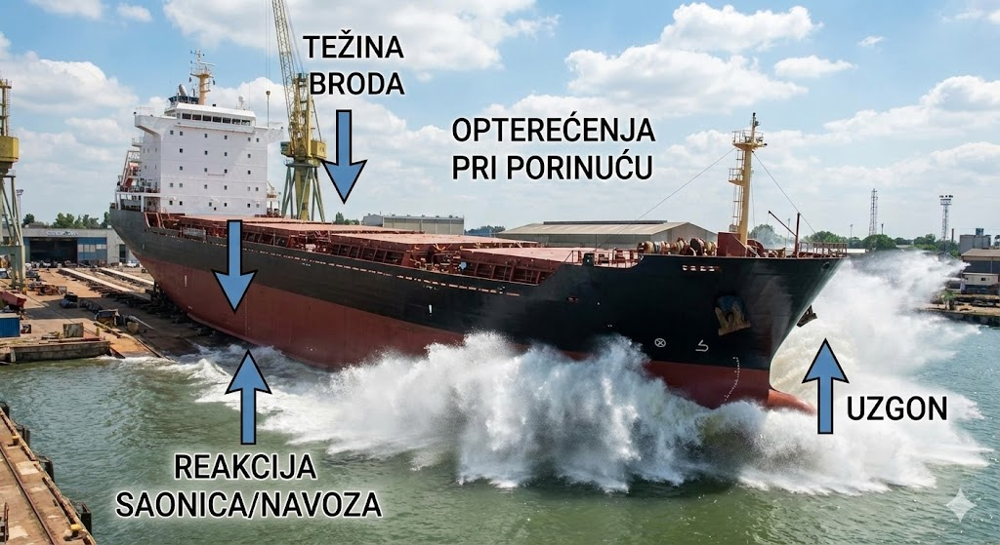

# Opterećenja na konstrukciju

## Prostorna podjela opterećenja

### Lokalna opterećenja

Lokalna opterećenja (e: *local loads*) djeluju na ograničeni, specifični dio brodske strukture. Analiza ovih opterećenja provodi se kako bi se odredila naprezanja (e: *stresses*) i deformacije uslijed savijanja pojedinačnih elemenata pod lokalnim pritiskom (npr. hidrostatski tlak mora, pritisak tereta, težina opreme). U te elemente ubrajamo:

- **Limove** (npr. limovi oplate, palube, pregrada / e: *plating*)
- **Obične ukrepe** (npr. uzdužnjaci, sponje, rebra / e: *ordinary stiffeners, longitudinals, transverse beams*)
- **Primarne nosive elemente** (npr. okvirna rebra, proveze, pasme / e: *primary supporting members, web frames, stringers*).

Precizna procjena lokalnih opterećenja ključna je za dimenzioniranje detalja i sprječavanje lokalnog otkazivanja materijala (plastičnih deformacija ili pukotina) na najosjetljivijim čvorovima brodske konstrukcije.

Ukoliko promatrani lokalni element doprinosi ukupnoj uzdužnoj čvrstoći broda (tj. proteže se neprekinuto duž trupa, poput uzdužnjaka na dnu ili palubi), ukupno naprezanje u tom elementu dobiva se **superpozicijom** (zbrajanjem) lokalnih i globalnih naprezanja.

### Globalna opterećenja

Globalna opterećenja (e: *global loads*) djeluju na brod u cjelini. U ovoj analizi, složeni brodski trup idealizira se i promatra kao ekvivalentni gredni nosač (e: *hull girder / equivalent beam*).

Globalna opterećenja nastaju kao posljedica nejednolike uzdužne raspodjele lokalnih sila po duljini broda. Konkretno, razlika između lokalne težine, odnosno rasporeda masa i tereta (e: *weight distribution*), i lokalnog uzgona (e: *buoyancy distribution*) u svakom poprečnom presjeku rezultira pojavom kontinuiranog opterećenja.

Matematičkom integracijom te razlike duž broda dobivamo krivulje unutarnjih sila:

- **Poprečne ili smične sile (e: *shear forces*):** Prva integracija krivulje opterećenja.
- **Momente savijanja (e: *bending moments*):** Druga integracija krivulje opterećenja.

Globalna opterećenja temelj su za dimenzioniranje glavnih uzdužnih konstrukcijskih elemenata broda (vanjske oplate, glavne palube, dvodna). Kako bi trup izdržao ova opterećenja bez loma (e: *structural failure*) uslijed prevelikog savijanja, proračunom je potrebno osigurati propisani minimalni moment otpora poprečnog presjeka (e: *section modulus*) i adekvatnu površinu poprečnog presjeka za preuzimanje smicanja (e: *shear area*).

Dobrom procjenom opterećenja sprječava se lom konstrukcije zbog premašivanja najvećeg dozvoljenog momenta savijanja broda (@fig-lom-prestige).

{#fig-lom-prestige width="70%"}

## Vremenska podjela opterećenja

### Statička opterećenja

Statička opterećenja (e: *static loads*) su ona opterećenja kod kojih se inercijske sile i dinamički efekti mogu u potpunosti zanemariti. Ova pretpostavka vrijedi za opterećenja koja su stacionarna ili se njihov intenzitet mijenja izuzetno sporo s periodom ponavljanja od nekoliko sati, dana ili duže. Takva opterećenja uključuju:

- **Opterećenja na mirnoj vodi (e: *still water loads*)**
- **Opterećenja pri dokovanju (e: *drydocking loads*)**
- **Toplinska ili termička opterećenja (e: *thermal loads*)** koja nastaju uslijed nejednolikog zagrijavanja trupa, npr. razlika temperature uronjenog dijela i palube izložene suncu, ili utjecaja zagrijanog/ohlađenog tereta.

Od navedenih, **opterećenja na mirnoj vodi** su najvažnija pri osnovnom projektiranju strukture broda. Ona su rezultat ravnoteže i međusobnog djelovanja vanjskih hidrostatskih tlakova (koji rezultiraju silom **uzgona / e: *buoyancy***) i unutarnjeg rasporeda masa, koji uključuje vlastitu masu broda, tekuće terete u tankovima te koncentrirane sile tereta poput vozila, putnika ili kontejnera (koji rezultiraju silom **težine / e: *weight***).

Ova opterećenja su nejednoliko distribuirana po duljini broda. Promjena forme trupa (e: *hull form*) uzrokuje nejednoliku raspodjelu uzgona, dok raspored tereta uzrokuje nejednoliku raspodjelu težine. Njihova razlika uzrokuje vertikalno savijanje trupa kao ekvivalentne grede. Problemom izračuna opterećenja, stabiliteta i plovnosti na mirnoj vodi bavi se grana brodogradnje zvana **statika broda** ili **hidrostatika (e: *ship hydrostatics*)**. Postoje dva osnovna stanja vertikalnog savijanja broda na mirnoj vodi: pregib i progib.

**Stanje pregiba (e: *hogging*):** Trup broda se savija na način da su središnji dijelovi potisnuti prema gore, a krajevi prema dolje. U ovom stanju, glavna paluba je **vlačno opterećena (e: *tensile stress*)**, dok je dno broda **tlačno opterećeno (e: *compressive stress*)**. Općenito, trgovački brodovi u balastu (e: *ballast condition*) gotovo su uvijek u stanju pregiba jer su im pramčani i krmeni tankovi puni, dok je sredina prazna. Kontejnerski brodovi su također inherentno u stanju pregiba, što je uvjetovano njihovom specifičnom finom formom, ali i svjesnom namjerom projektanata da se široka, otvorena paluba kontejnerskih brodova (koja ima manjak materijala zbog velikih grotala) rastereti od opasnih tlačnih naprezanja koja bi mogla izazvati izvijanje (e: *buckling*).

**Stanje progiba (e: *sagging*):** Trup broda se savija na način da su središnji dijelovi potisnuti prema dolje, a krajevi prema gore (koncentracija mase je u sredini broda). U ovom stanju, glavna paluba je **tlačno opterećena**, dok je dno broda **vlačno opterećeno**. Primjerice, veliki tankeri (e: *VLCC / ULCC*) pod punim opterećenjem su tipično u stanju progiba, a istom stanju podložni su i brodovi za prijevoz rasutih tereta (e: *bulk carriers*) kada su im središnja skladišta nakrcana teškom rudačom.

### Dinamička periodička opterećenja

Dinamička periodična opterećenja (e: *dynamic periodic loads*) nazivaju se još i sporo promjenjivim dinamičkim opterećenjima. Njihov period ponavljanja izravno je povezan i otprilike odgovara periodu nailaska morskih valova (koji se u naravi kreće od 1 do 20 sekundi). U ovu skupinu prvenstveno ubrajamo:

- **Valna opterećenja (e: *wave loads*):** Nastaju uslijed promjenjivih hidrodinamičkih tlakova morskih valova koji djeluju na vanjsku oplatu broda.
- **Slobodne površine tekućina (e: *sloshing*):** Zapljuskivanje tekućeg tereta, goriva ili vodenog balasta unutar djelomično napunjenih tankova. Uslijed kretanja broda na valovima, mase tekućine vrše naizmjenične udare na unutarnje elemente konstrukcije (pregrade, palube, ukrepe).

Pri projektiranju broda, ključni korak je procjena maksimalnih dinamičkih valnih opterećenja te njihova **superpozicija** (zbrajanje) sa statičkim opterećenjima na mirnoj vodi.

Najveća opasnost za uzdužnu čvrstoću broda nastupa kada brod naiđe pramcem ili krmom na val čija je duljina približno jednaka duljini samog broda ($\lambda \approx L$). To možemo ilustrirati pojednostavljenim primjerom nejednoliko opterećenog pontona:

1. **Maksimalni pregib (e: *maximum hogging*):** Pretpostavimo ponton čiji su krajevi teško opterećeni, a sredina prazna. Na mirnoj vodi on je već u stanju **pregiba**. Kada takav ponton na valovitom moru zajaše na **brijeg vala** (e: *wave crest*) koji prolazi točno sredinom njegove duljine, uzgon u sredini se drastično povećava, dok krajevi gube podršku mora. Tada se valni moment savijanja dodaje onom na mirnoj vodi i pregib doseže svoj apsolutni maksimum.
2. **Maksimalni progib (e: *maximum sagging*):** Ako je ponton opterećen teškim teretom u sredini, na mirnoj vodi nalazi se u stanju **progiba**. Kada se takav ponton nađe tako da mu sredina upadne u **dol vala** (e: *wave trough*), a pramac i krma leže na susjednim brijegovima, uzgon na krajevima se povećava, a u sredini pada. Valni moment savijanja ponovno se pribraja onom na mirnoj vodi i ponton doživljava maksimalni progib.

Za dimenzioniranje poprečnih presjeka brodskog trupa, najvažnija komponenta globalnog opterećenja je **vertikalni valni moment savijanja** (e: *vertical wave bending moment - VWBM*). Kod brodova s velikim palubnim otvorima, poput kontejnerskih brodova, izuzetno je opasan i **moment torzije** ili uvijanja (e: *torsional moment*). On se javlja zbog asimetričnog opterećenja pri kosom nailasku na valove te uzrokuje deformacije na krajevima teretnog prostora zbog spriječenog vitoperenja (e: *warping*).

### Brzo promjenjiva dinamička opterećenja

Ova skupina obuhvaća opterećenja koja se mijenjaju izrazito brzo, imaju visok intenzitet i uzrokuju tranzijentno ili ustaljeno vibriranje brodskog trupa. To su tzv. dinamička udarna i visokofrekventna opterećenja, a uključuju sljedeće pojave:

- **Udar pramca o valove (e: *slamming*):** Tijekom plovidbe velike amplitude poniranja i posrtanja mogu dovesti do potpunog izranjanja pramca te njegovog silovitog udara o slobodnu površinu pri ponovnom uranjanju. Ova složena hidrodinamička pojava stvara ogromne tlakove na dno pramca.
- **Podrhtavanje trupa (e: *whipping*):** Direktna posljedica *slamminga*. Snažan udar u pramcu izaziva brze, prolazne vibracije čitavog trupa. *Whipping* može ozbiljno ugroziti globalnu čvrstoću jer dodatno povećava momente savijanja.

  {#fig-whipping}
- **Zalijevanje palube (e: *green water*):** Pod zalijevanjem palube podrazumijeva se prelijevanje i udar masivnih količina morske vode preko izložene palube koje udaraju u valobran (e: *breakwater*) ili prednju stijenku nadgrađa uslijed udara pramca u val.
- **Elastično vibriranje trupa / Pružanje (e: *springing*):** Za razliku od podrhtavanja trupa, *springing* je pojava *ustaljenog* vibriranja trupa na valovima. Nastaje kao posljedica rezonancije, odnosno kada se neka prirodna frekvencija trupa poklopi s frekvencijom nailaska valova. Ova pojava je kritična prvenstveno za vrlo dugačke i "fleksibilne" brodove, poput ultra-velikih kontejnerskih brodova (e: *ULCS*). Analizom *springing* i *whipping* pojava bavi se napredna znanstvena disciplina *hidroelastičnost* (e: *hydroelasticity*).
- **Dahtanje (e: *panting*):** Promjenjivi lokalni hidrodinamički tlakovi na limove pramčane oplate. Nastaju uslijed naizmjeničnog uranjanja i izranjanja pramca pri posrtanju (te su i dobili naziv poput "disanja" strukture), što je posebno izraženo kod brodova vitkih, oštrih formi.
- **Prisilne vibracije (e: *induced vibrations*)** su visokofrekventna dinamička opterećenja kontinuirano pobuđena, npr. radom glavnog brodskog stroja ili hidrodinamičkim impulsima zbog tlaka koje rotirajući brodski vijak pri svakom prolazu krila prenosi na strukturu krme.
- **Opterećenja pri porinuću (e: *launching loads*)** predstavljaju kritična, jednokratna tranzijentna opterećenja na trup koja nastaju uslijed nagle preraspodjele sila težine, uzgona i reakcije saonica prilikom spuštanja novogradnje s navoza u more.

  {#fig-opterecenja-porinuce width="50%"}

### Sprega sila, naprezanja i gibanja

Pomorstvenost se bavi analizom naprezanja i odziva/gibanja broda na morskim valovima. Dinamika broda opisuje se jednadžbama gibanja koje uravnotežuju vanjske uzbudne sile (valove) s inercijalnim i prigušnim silama samog broda.

Budući da je uzburkano more potpuno nepravilno, ono se u modernoj brodogradnji promatra kao stohastički ili slučajni proces (e: *random process*). Pomoću spektralne analize (e: *spectral analysis*) i metoda matematičke statistike, inženjeri procjenjuju **ekstremne vrijednosti** (e: *extreme values*) valnih opterećenja koja imaju vrlo malu vjerojatnost premašivanja (e: *probability of exceedance*) u predviđenom životnom vijeku broda (obično 20-25 godina). Klasifikacijska društva temelje svoja pravila i približne formule upravo na ovim statističkim metodama pomorstvenosti.
