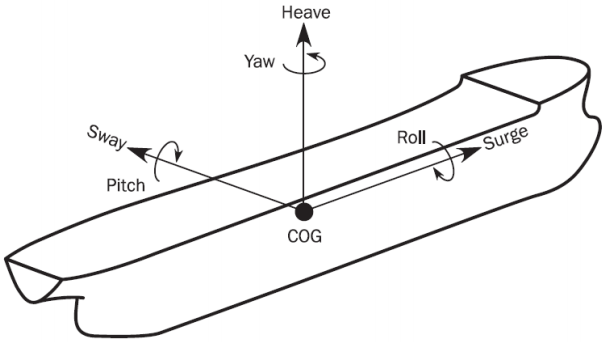

# Osnovni pojmovi

## Uvod

**Pomorstvenost** (e: *seakeeping*) je grana brodograđevne znanosti koja proučava dinamičko ponašanje broda na valovitom moru. Bavi se odzivima, odnosno kretanjima broda (e: *ship motions / ship responses*) i dinamičkim opterećenjima (e: *dynamic loads*) kojima je brodska struktura izložena u stvarnim, promjenjivim morskim uvjetima (e: *sea conditions*), što prvenstveno uključuje djelovanje valova (e: *waves*), vjetra (e: *wind*) i morskih struja (e: *ocean currents*).

Proučavanje pomorstvenosti od izuzetne je inženjerske važnosti iz nekoliko razloga:

- **Sigurnost i strukturni integritet (e: *safety and structural integrity*):** Pomorstvenost je presudna za opstanak broda i sigurnost posade. Brodovi s lošim karakteristikama pomorstvenosti na valovitom moru podložni su dinamičkim pojavama koje mogu dovesti do oštećenja strukture trupa, gubitka stabiliteta, naplavljivanja (e: *flooding*) pa čak i prevrtanja (e: *capsizing*).
- **Radna sposobnost i udobnost (e: *operability and habitability*):** Kretanja broda izravno utječu na radne sposobnosti posade i udobnost putnika. Pretjerana kretanja (posebno ubrzanja) uzrokuju morsku bolest (e: *seasickness / motion sickness*) i kronični umor, dok dugotrajna izloženost nepovoljnim biodinamičkim odzivima može ostaviti trajne posljedice na mišićno-koštani sustav (osobito zglobove) posade. Također, prevelika kretanja mogu onemogućiti izvođenje radnih operacija na palubi.
- **Plovna svojstva i performanse (e: *ship performance*):** Pomorstvenost izravno utječe na ekonomičnost i upravljivost broda. Uslijed djelovanja valova i vjetra javlja se dodatni otpor (e: *added resistance in waves*). Brodovi koji doživljavaju snažne odzive često gube na brzini (tzv. voljni i nevoljni gubitak brzine – e: *voluntary and involuntary speed loss*) te imaju poteškoća u održavanju zadanog kursa (e: *course keeping*).

Na karakteristike pomorstvenosti utječe niz složenih, međusobno povezanih čimbenika:

- **Projekt broda (e: *ship design*):** Parametri poput oblika trupa (e: *hull form*), glavnih dimenzija i rasporeda masa (e: *mass distribution / weight distribution*) izravno utječu na to kako će brod reagirati na uzbudne sile.
- **Stanje mora (e: *sea state*):** Svojstva morskih valova, prvenstveno njihova značajna visina (e: *significant wave height*) i period/frekvencija (e: *wave period / frequency*), najvažniji su vanjski uzbudni čimbenici.
- **Vjetar (e: *wind*):** Aerodinamičke sile vjetra posebno su izražene kod plovila s velikim nadvođima (e: *freeboard*) i nadgrađima (e: *superstructure*), odnosno velikom površinom izloženom vjetru (e: *windage area*).
- **Stanje krcanja (e: *loading condition*):** Količina i raspored tereta mijenjaju položaj težišta broda (e: *center of gravity*) i metacentarsku visinu (e: *metacentric height*). Primjerice, brod s previsokim težištem gubi stabilitet, dok brod s preniskim težištem (prevelikim stabilitetom) postaje prekrut (e: *stiff ship*) i doživljava nagla, neugodna i opasna ljuljanja s velikim ubrzanjima.

## Koordinatni sustav i gibanja

Za analizu dinamike broda na valovima, brod se promatra kao kruto tijelo (e: *rigid body*) u prostoru.

Gibanje krutog tijela opisuje se pomoću matematičkog modela sa šest stupnjeva slobode gibanja (e: *six degrees of freedom - 6 DOF*), 3 stupnja translacije (e: *translation*) i 3 stupnja rotacije (e: *rotation*). Gibanja još nazivamo i njihanje (na valovima).

Za opisivanje ovih kretanja najčešće se koristi brodski pravokutni, odnosno Kartezijev koordinatni sustav (e: *ship-fixed Cartesian coordinate system*). Ishodište ovog sustava obično se postavlja u težište broda (e: *centre of gravity - CG/CoG*).

Osi standardnog koordinatnog sustava definirane su na sljedeći način:

- **Os X (uzdužna os / e: *longitudinal axis*):** Usmjerena vodoravno prema pramcu (e: *bow*).
- **Os Y (poprečna os / e: *transverse axis*):** Usmjerena vodoravno prema boku broda (najčešće prema lijevom boku za desnokretni sustav / e: *port side*).
- **Os Z (vertikalna os / e: *vertical axis*):** Usmjerena okomito prema gore.

Tri translacijska gibanja predstavljaju linearna pomicanja težišta broda duž koordinatnih osi:

- **Zalijetanje** (e: *surge*) naprijed-nazad u uzdužnom smjeru osi $X$,
- **Zanošenje** (e: *sway*) lijevo-desno u poprečnom smjeru osi $Y$,
- **Poniranje** (e: *heave*) gore-dolje u vertikalnom smjeru osi $Z$.

Rotacijska gibanja predstavljaju kutna zakretanja broda oko koordinatnih osi:

- **Ljuljanje** ili **valjanje** (e: *roll*) oko uzdužne osi $X$,
- **Posrtanje** (e: *pitch*) tj. dizanje pramca/krme oko poprečne osi $Y$,
- **Zaošijanje** (e: *yaw*) tj. zakretanja pramca lijevo-desno oko vertikalne osi $Z$.

{#fig-koordinatni-sustav width="70%"}

## Vrste opterećenja

Tijekom svog radnog vijeka, brod je izložen složenom sustavu sila koje uzrokuju naprezanja (e: *stresses*) i deformacije (e: *deformations*) u njegovoj strukturi.

Kako bi se olakšala analiza i proračun čvrstoće, opterećenja brodskih konstrukcija (e: *structural loads*) sustavno se dijele prema dva osnovna kriterija: **prostornom obuhvatu** i **vremenskoj promjenljivosti**.

Podjela prema prostornom obuhvatu, odnosno prema tome koji dio brodske konstrukcije preuzima i prenosi zadano opterećenje:

1. **Globalna opterećenja (e: *global loads*)** djeluju na brod kao cjelinu, pri čemu se trup broda promatra kao ekvivalentna greda (e: *hull girder*). Ova opterećenja uzrokuju opće uzdužno savijanje broda, poput pr**o**giba (e: *sagging*) i pr**e**giba (e: *hogging*) na valovima, te globalno uvijanje i smicanje.
2. **Lokalna opterećenja (e: *local loads*)** djeluju na pojedinačne elemente brodske konstrukcije, poput limova oplate, ukrepa, rebara ili pojedinih paluba. Primjeri uključuju hidrostatski tlak mora na određeni lim vanjske oplate, težinu montiranog stroja i sl.

Podjela prema vremenskoj promjenljivosti opterećenja s obzirom na to kako se njihov intenzitet, smjer i hvatište mijenjaju u vremenu:

1. **Statička opterećenja (e: *static loads*)** koja su konstantna ili se vrlo sporo mijenjaju tijekom vremena. U ovu skupinu prvenstveno ubrajamo vlastitu masu praznog broda (e: *lightship weight*), masu tereta, goriva i zaliha (e: *deadweight*) te statički uzgon u mirnoj vodi (e: *still water buoyancy*).
2. **Dinamička periodična opterećenja (e: *dynamic periodic loads / cyclic loads*):** Opterećenja koja se kontinuirano i ciklički mijenjaju. Glavni uzročnici su prolazak morskih valova, koji neprestano mijenjaju raspodjelu uzgona duž broda, te vibracije koje proizvode glavni brodski motori i brodski vijak (e: *propeller*). Zbog svoje ciklične prirode, ova opterećenja su glavni uzrok zamora materijala (e: *fatigue*).
3. **Dinamička udarna opterećenja (e: *dynamic impact loads*):** Kratkotrajna, iznenadna opterećenja vrlo visokog intenziteta. Najčešće nastaju uslijed snažnog udara pramca u valove (e: *slamming*), zapljuskivanja palube ogromnim masama mora (e: *green water on deck*) ili snažnog udaranja tekućine o stjenke djelomično napunjenih brodskih tankova (e: *sloshing*).
