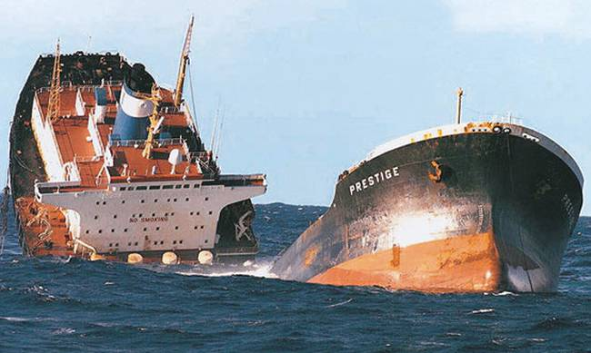
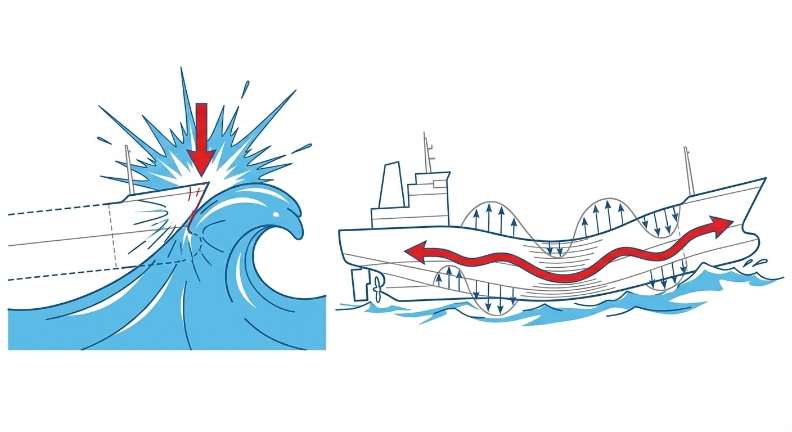
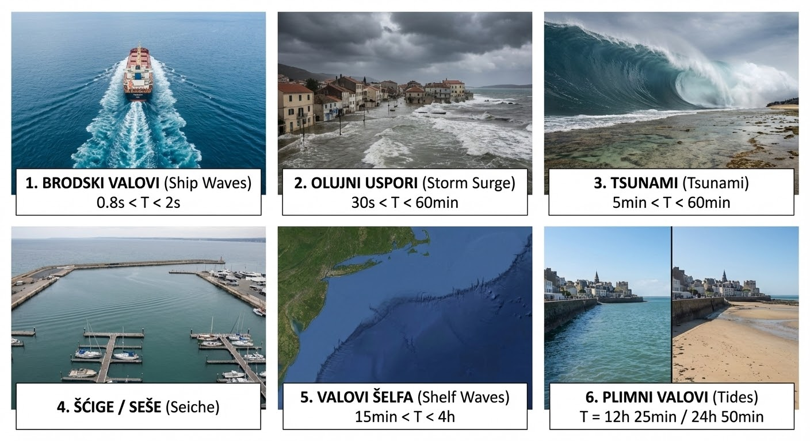
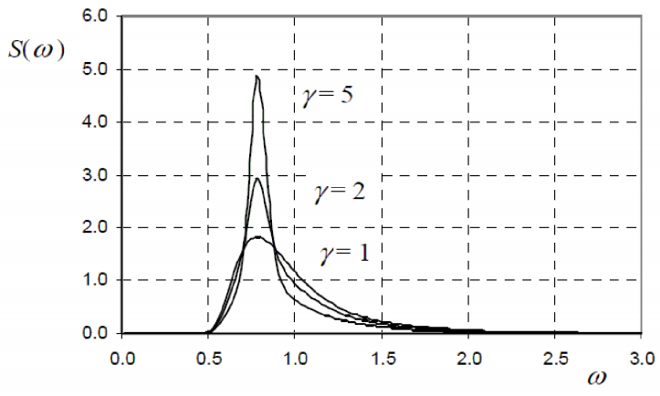
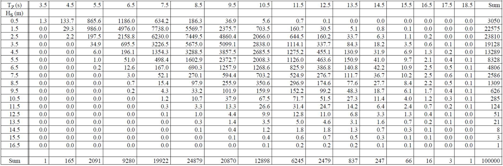

# Osnovni pojmovi

## Uvod

**Pomorstvenost** (e: *seakeeping*) je grana brodograđevne znanosti koja proučava dinamičko ponašanje broda na valovitom moru. Bavi se odzivima, odnosno kretanjima broda (e: *ship motions / ship responses*) i dinamičkim opterećenjima (e: *dynamic loads*) kojima je brodska struktura izložena u stvarnim, promjenjivim morskim uvjetima (e: *sea conditions*), što prvenstveno uključuje djelovanje valova (e: *waves*), vjetra (e: *wind*) i morskih struja (e: *ocean currents*).

Proučavanje pomorstvenosti od izuzetne je inženjerske važnosti iz nekoliko razloga:

- **Sigurnost i strukturni integritet (e: *safety and structural integrity*):** Pomorstvenost je presudna za opstanak broda i sigurnost posade. Brodovi s lošim karakteristikama pomorstvenosti na valovitom moru podložni su dinamičkim pojavama koje mogu dovesti do oštećenja strukture trupa, gubitka stabiliteta, naplavljivanja (e: *flooding*) pa čak i prevrtanja (e: *capsizing*).
- **Radna sposobnost i udobnost (e: *operability and habitability*):** Kretanja broda izravno utječu na radne sposobnosti posade i udobnost putnika. Pretjerana kretanja (posebno ubrzanja) uzrokuju morsku bolest (e: *seasickness / motion sickness*) i kronični umor, dok dugotrajna izloženost nepovoljnim biodinamičkim odzivima može ostaviti trajne posljedice na mišićno-koštani sustav (osobito zglobove) posade. Također, prevelika kretanja mogu onemogućiti izvođenje radnih operacija na palubi.
- **Plovna svojstva i performanse (e: *ship performance*):** Pomorstvenost izravno utječe na ekonomičnost i upravljivost broda. Uslijed djelovanja valova i vjetra javlja se dodatni otpor (e: *added resistance in waves*). Brodovi koji doživljavaju snažne odzive često gube na brzini (tzv. voljni i nevoljni gubitak brzine – e: *voluntary and involuntary speed loss*) te imaju poteškoća u održavanju zadanog kursa (e: *course keeping*).

Na karakteristike pomorstvenosti utječe niz složenih, međusobno povezanih čimbenika:

- **Projekt broda (e: *ship design*):** Parametri poput oblika trupa (e: *hull form*), glavnih dimenzija i rasporeda masa (e: *mass distribution / weight distribution*) izravno utječu na to kako će brod reagirati na uzbudne sile.
- **Stanje mora (e: *sea state*):** Svojstva morskih valova, prvenstveno njihova značajna visina (e: *significant wave height*) i period/frekvencija (e: *wave period / frequency*), najvažniji su vanjski uzbudni čimbenici.
- **Vjetar (e: *wind*):** Aerodinamičke sile vjetra posebno su izražene kod plovila s velikim nadvođima (e: *freeboard*) i nadgrađima (e: *superstructure*), odnosno velikom površinom izloženom vjetru (e: *windage area*).
- **Stanje krcanja (e: *loading condition*):** Količina i raspored tereta mijenjaju položaj težišta broda (e: *center of gravity*) i metacentarsku visinu (e: *metacentric height*). Primjerice, brod s previsokim težištem gubi stabilitet, dok brod s preniskim težištem (prevelikim stabilitetom) postaje prekrut (e: *stiff ship*) i doživljava nagla, neugodna i opasna ljuljanja s velikim ubrzanjima.

## Koordinatni sustav i gibanja

Za analizu dinamike broda na valovima, brod se promatra kao kruto tijelo (e: *rigid body*) u prostoru.

Gibanje krutog tijela opisuje se pomoću matematičkog modela sa šest stupnjeva slobode gibanja (e: *six degrees of freedom - 6 DOF*), 3 strupnja translacije (e: *translation*) i 3 stupnja rotacije (e: *rotation*). Gibanja još nazivamo i njihanje (na valovima).

Za opisivanje ovih kretanja najčešće se koristi brodski pravokutni, odnosno Kartezijev koordinatni sustav (e: *ship-fixed Cartesian coordinate system*). Ishodište ovog sustava obično se postavlja u težište broda (e: *centre of gravity - CG/CoG*).

Osi standardnog koordinatnog sustava definirane su na sljedeći način:

- **Os X (uzdužna os / e: *longitudinal axis*):** Usmjerena vodoravno prema pramcu (e: *bow*).
- **Os Y (poprečna os / e: *transverse axis*):** Usmjerena vodoravno prema boku broda (najčešće prema lijevom boku za desnokretni sustav / e: *port side*).
- **Os Z (vertikalna os / e: *vertical axis*):** Usmjerena okomito prema gore.

Tri translacijska gibanja predstavljaju linearna pomicanja težišta broda duž koordinatnih osi:

- **Zalijetanje** (e: *surge*) naprijed-nazad u uzdužnom smjeru osi $X$,
- **Zanošenje** (e: *sway*) lijevo-desno u poprečnom smjeru osi $Y$,
- **Poniranje** (e: *heave*) gore-dolje u vertikalnom smjeru osi $Z$.

Rotacijska gibanja predstavljaju kutna zakretanja broda oko koordinatnih osi:

- **Ljuljanje** ili **valjanje** (e: *roll*) oko uzdužne osi $X$,
- **Posrtanje** (e: *pitch*) tj. dizanje pramca/krme oko poprečne osi $Y$,
- **Zaošijanje** (e: *yaw*) tj. zakretanja pramca lijevo-desno oko vertikalne osi $Z$.

::: {#fig-QHuluHMKdt}
{width="70%"}

Koordinatni sustav za pozitivne smjerove gibanja, prema definicijama DNV/GL.
:::


## Vrste opterećenja

Tijekom svog radnog vijeka, brod je izložen složenom sustavu sila koje uzrokuju naprezanja (e: *stresses*) i deformacije (e: *deformations*) u njegovoj strukturi.

Kako bi se olakšala analiza i proračun čvrstoće, opterećenja brodskih konstrukcija (e: *structural loads*) sustavno se dijele prema dva osnovna kriterija: **prostornom obuhvatu** i **vremenskoj promjenljivosti**.

Podjela prema prostornom obuhvatu, odnosno dijelu brodske konstrukcije preuzima i prenosi zadano opterećenje:

1. **Globalna opterećenja (e: *global loads*)** djeluju na brod kao cjelinu, pri čemu se trup broda promatra kao ekvivalentna greda (e: *hull girder*). Ova opterećenja uzrokuju opće uzdužno savijanje broda, poput pr**o**giba (e: *sagging*) i pr**e**giba (e: *hogging*) na valovima, te globalno uvijanje i smicanje.
2. **Lokalna opterećenja (e: *local loads*)** djeluju na pojedinačne elemente brodske konstrukcije, poput limova oplate, ukrepa, rebara ili pojedinih paluba. Primjeri uključuju hidrostatski tlak mora na određeni lim vanjske oplate, težinu montiranog stroja i sl.

Podjela prema vremenskoj promjenljivosti opterećenja s obzirom na to kako se njihov intenzitet, smjer i hvatište mijenjaju u vremenu:

1. **Statička opterećenja (e: *static loads*)** koja su konstantna ili se vrlo sporo mijenjaju tijekom vremena. U ovu skupinu prvenstveno ubrajamo vlastitu masu praznog broda (e: *lightship weight*), masu tereta, goriva i zaliha (e: *deadweight*) te statički uzgon u mirnoj vodi (e: *still water buoyancy*).
2. **Dinamička periodična opterećenja (e: *dynamic periodic loads / cyclic loads*):** Opterećenja koja se kontinuirano i ciklički mijenjaju. Glavni uzročnici su prolazak morskih valova, koji neprestano mijenjaju raspodjelu uzgona duž broda, te vibracije koje proizvode glavni brodski motori i brodski vijak (e: *propeller*). Zbog svoje ciklične prirode, ova opterećenja su glavni uzrok zamora materijala (e: *fatigue*).
3. **Dinamička udarna opterećenja (e: *dynamic impact loads*):** Kratkotrajna, iznenadna opterećenja vrlo visokog intenziteta. Najčešće nastaju uslijed snažnog udara pramca u valove (e: *slamming*), zapljuskivanja palube ogromnim masama mora (e: *green water on deck*) ili snažnog udaranja tekućine o stjenke djelomično napunjenih brodskih tankova (e: *sloshing*).

# Opterećenja na konstrukciju

## Prostorna podjela opterećenja

### Lokalna opterećenja

Lokalna opterećenja (e: *local loads*) djeluju na ograničeni, specifični dio brodske strukture. Analiza ovih opterećenja provodi se kako bi se odredila naprezanja (e: *stresses*) i deformacije uslijed savijanja pojedinačnih elemenata pod lokalnim pritiskom (npr. hidrostatski tlak mora, pritisak tereta, težina opreme). U te elemente ubrajamo:

- **Limove** (npr. limovi oplate, palube, pregrada / e: *plating*)
- **Obične ukrepe** (npr. uzdužnjaci, sponje, rebra / e: *ordinary stiffeners, longitudinals, transverse beams*)
- **Primarne nosive elemente** (npr. okvirna rebra, proveze, pasme / e: *primary supporting members, web frames, stringers*).

Precizna procjena lokalnih opterećenja ključna je za dimenzioniranje detalja i sprječavanje lokalnog otkazivanja materijala (plastičnih deformacija ili pukotina) na najosjetljivijim čvorovima brodske konstrukcije.

Ukoliko promatrani lokalni element doprinosi ukupnoj uzdužnoj čvrstoći broda (tj. proteže se neprekinuto duž trupa, poput uzdužnjaka na dnu ili palubi), ukupno naprezanje u tom elementu dobiva se **superpozicijom** (zbrajanjem) lokalnih i globalnih naprezanja.

### Globalna opterećenja

Globalna opterećenja (e: *global loads*) djeluju na brod u cjelini. U ovoj analizi, složeni brodski trup idealizira se i promatra kao ekvivalentni gredni nosač (e: *hull girder / equivalent beam*).

Globalna opterećenja nastaju kao posljedica nejednolike uzdužne raspodjele lokalnih sila po duljini broda. Konkretno, razlika između lokalne težine, odnosno rasporeda masa i tereta (e: *weight distribution*), i lokalnog uzgona (e: *buoyancy distribution*) u svakom poprečnom presjeku rezultira pojavom kontinuiranog opterećenja.

Matematičkom integracijom te razlike duž broda dobivamo krivulje unutarnjih sila:

- **Poprečne ili smične sile (e: *shear forces*):** Prva integracija krivulje opterećenja.
- **Momente savijanja (e: *bending moments*):** Druga integracija krivulje opterećenja.

Globalna opterećenja temelj su za dimenzioniranje glavnih uzdužnih konstrukcijskih elemenata broda (vanjske oplate, glavne palube, dvodna). Kako bi trup izdržao ova opterećenja bez loma (e: *structural failure*) uslijed prevelikog savijanja, proračunom je potrebno osigurati propisani minimalni moment otpora poprečnog presjeka (e: *section modulus*) i adekvatnu površinu poprečnog presjeka za preuzimanje smicanja (e: *shear area*).

Dobrom procjenom opterećenja sprječava se lom konstrukcije zbog premašivanja najvećeg dozvoljenog momenta savijanja broda {numref}`Figure %s <pfpxNz95U8>`.

::: {#fig-pfpxNz95U8}
{width="70%"}

Lom trgovačkog broda ”Presitge”
:::


## Vremenska podjela opterećenja

### Statička opterećenja

Statička opterećenja (e: *static loads*) su ona opterećenja kod kojih se inercijske sile i dinamički efekti mogu u potpunosti zanemariti. Ova pretpostavka vrijedi za opterećenja koja su stacionarna ili se njihov intenzitet mijenja izuzetno sporo s periodom ponavljanja od nekoliko sati, dana ili duže. Takva opterećenja uključuju:

- **Opterećenja na mirnoj vodi (e: *still water loads*)**
- **Opterećenja pri dokovanju (e: *drydocking loads*)**
- **Toplinska ili termička opterećenja (e: *thermal loads*)** koja nastaju uslijed nejednolikog zagrijavanja trupa, npr. razlika temperature uronjenog dijela i palube izložene suncu, ili utjecaja zagrijanog/ohlađenog tereta.

Od navedenih, **opterećenja na mirnoj vodi** su najvažnija pri osnovnom projektiranju strukture broda. Ona su rezultat ravnoteže i međusobnog djelovanja vanjskih hidrostatskih tlakova (koji rezultiraju silom **uzgona / e: *buoyancy***) i unutarnjeg rasporeda masa, koji uključuje vlastitu masu broda, tekuće terete u tankovima te koncentrirane sile tereta poput vozila, putnika ili kontejnera (koji rezultiraju silom **težine / e: *weight***).

Ova opterećenja su nejednoliko distribuirana po duljini broda. Promjena forme trupa (e: *hull form*) uzrokuje nejednoliku raspodjelu uzgona, dok raspored tereta uzrokuje nejednoliku raspodjelu težine. Njihova razlika uzrokuje vertikalno savijanje trupa kao ekvivalentne grede. Problemom izračuna opterećenja, stabiliteta i plovnosti na mirnoj vodi bavi se grana brodogradnje zvana **statika broda** ili **hidrostatika (e: *ship hydrostatics*)**. Postoje dva osnovna stanja vertikalnog savijanja broda na mirnoj vodi: pregib i progib.

**Stanje pregiba (e: *hogging*):** Trup broda se savija na način da su središnji dijelovi potisnuti prema gore, a krajevi prema dolje. U ovom stanju, glavna paluba je **vlačno opterećena (e: *tensile stress*)**, dok je dno broda **tlačno opterećeno (e: *compressive stress*)**. Općenito, trgovački brodovi u balastu (e: *ballast condition*) gotovo su uvijek u stanju pregiba jer su im pramčani i krmeni tankovi puni, dok je sredina prazna. Kontejnerski brodovi su također inherentno u stanju pregiba, što je uvjetovano njihovom specifičnom finom formom, ali i svjesnom namjerom projektanata da se široka, otvorena paluba kontejnerskih brodova (koja ima manjak materijala zbog velikih grotala) rastereti od opasnih tlačnih naprezanja koja bi mogla izazvati izvijanje (e: *buckling*).

**Stanje progiba (e: *sagging*):** Trup broda se savija na način da su središnji dijelovi potisnuti prema dolje, a krajevi prema gore (koncentracija mase je u sredini broda). U ovom stanju, glavna paluba je **tlačno opterećena**, dok je dno broda **vlačno opterećeno**. Primjerice, veliki tankeri (e: *VLCC / ULCC*) pod punim opterećenjem su tipično u stanju progiba, a istom stanju podložni su i brodovi za prijevoz rasutih tereta (e: *bulk carriers*) kada su im središnja skladišta nakrcana teškom rudačom.

### Dinamička periodička opterećenja

Dinamička periodična opterećenja (e: *dynamic periodic loads*) nazivaju se još i sporo promjenjivim dinamičkim opterećenjima. Njihov period ponavljanja izravno je povezan i otprilike odgovara periodu nailaska morskih valova (koji se u naravi kreće od 1 do 20 sekundi). U ovu skupinu prvenstveno ubrajamo:

- **Valna opterećenja (e: *wave loads*):** Nastaju uslijed promjenjivih hidrodinamičkih tlakova morskih valova koji djeluju na vanjsku oplatu broda.
- **Slobodne površine tekućina (e: *sloshing*):** Zapljuskivanje tekućeg tereta, goriva ili vodenog balasta unutar djelomično napunjenih tankova. Uslijed kretanja broda na valovima, mase tekućine vrše naizmjenične udare na unutarnje elemente konstrukcije (pregrade, palube, ukrepe).

Pri projektiranju broda, ključni korak je procjena maksimalnih dinamičkih valnih opterećenja te njihova **superpozicija** (zbrajanje) sa statičkim opterećenjima na mirnoj vodi.

Najveća opasnost za uzdužnu čvrstoću broda nastupa kada brod naiđe pramcem ili krmom na val čija je duljina približno jednaka duljini samog broda ($\lambda \approx L$). To možemo ilustrirati pojednostavljenim primjerom nejednoliko opterećenog pontona:

1. **Maksimalni pregib (e: *maximum hogging*):** Pretpostavimo ponton čiji su krajevi teško opterećeni, a sredina prazna. Na mirnoj vodi on je već u stanju **pregiba**. Kada takav ponton na valovitom moru zajaše na **brijeg vala** (e: *wave crest*) koji prolazi točno sredinom njegove duljine, uzgon u sredini se drastično povećava, dok krajevi gube podršku mora. Tada se valni moment savijanja dodaje onom na mirnoj vodi i pregib doseže svoj apsolutni maksimum.
2. **Maksimalni progib (e: *maximum sagging*):** Ako je ponton opterećen teškim teretom u sredini, na mirnoj vodi nalazi se u stanju **progiba**. Kada se takav ponton nađe tako da mu sredina upadne u **dol vala** (e: *wave trough*), a pramac i krma leže na susjednim brijegovima, uzgon na krajevima se povećava, a u sredini pada. Valni moment savijanja ponovno se pribraja onom na mirnoj vodi i ponton doživljava maksimalni progib.

Za dimenzioniranje poprečnih presjeka brodskog trupa, najvažnija komponenta globalnog opterećenja je **vertikalni valni moment savijanja** (e: *vertical wave bending moment - VWBM*). Kod brodova s velikim palubnim otvorima, poput kontejnerskih brodova, izuzetno je opasan i **moment torzije** ili uvijanja (e: *torsional moment*). On se javlja zbog asimetričnog opterećenja pri kosom nailasku na valove te uzrokuje deformacije na krajevima teretnog prostora zbog spriječenog vitoperenja (e: *warping*).

### Brzo promjenjiva dinamička opterećenja

Ova skupina obuhvaća opterećenja koja se mijenjaju izrazito brzo, imaju visok intenzitet i uzrokuju tranzijentno ili ustaljeno vibriranje brodskog trupa. To su tzv. dinamička udarna i visokofrekventna opterećenja, a uključuju sljedeće pojave:

- **Udar pramca o valove (e: *slamming*):** Tijekom plovidbe velike amplitude poniranja i posrtanja mogu dovesti do potpunog izranjanja pramca te njegovog silovitog udara o slobodnu površinu pri ponovnom uranjanju. Ova složena hidrodinamička pojava stvara ogromne tlakove na dno pramca.
- **Podrhtavanje trupa (e: *whipping*):** Direktna posljedica *slamminga*. Snažan udar u pramcu izaziva brze, prolazne vibracije čitavog trupa. *Whipping* može ozbiljno ugroziti globalnu čvrstoću jer dodatno povećava momente savijanja.

  ::: {#fig-kZfIKvD5qG}


**Podrhtavanje trupa kao poslijedica udara pramca**
  ```
- **Zalijevanje palube (e: *green water*):** smatra prelijevanje i udar masivnih količina morske vode koje na izloženu palubu i udaraju u valobran (e: *breakwater*) ili prednju stijenku nadgrađa uslijed udara pramca u val.
- **Elastično vibriranje trupa / Pružanje (e: *springing*):** Za razliku od podrhtavanja trupa, *springing* je pojava *ustaljenog* vibriranja trupa na valovima. Nastaje kao posljedica rezonancije, odnosno kada se neka prirodna frekvencija trupa poklopi s frekvencijom nailaska valova. Ova pojava je kritična prvenstveno za vrlo dugačke i "fleksibilne" brodove, poput ultra-velikih kontejnerskih brodova (e: *ULCS*). Analizom *springing* i *whipping* pojama bavi se napredna znanstvena disciplina *hidroelastičnost* (e: *hydroelasticity*).
- **Dahtanje (e: *panting*):** Promjenjivi lokalni hidrodinamički tlakovi na limove pramčane oplate. Nastaju uslijed naizmjeničnog uranjanja i izranjanja pramca pri posrtanju (te su i dobili naziv poput "disanja" strukture), što je posebno izraženo kod brodova vitkih, oštrih formi.
- **Prisilne vibracije (e: *induced vibrations*)** su visokofrekventna dinamička opterećenja kontinuirano pobuđena, npr. radom glavnog brodskog stroja ili hidrodinamičkim impulsima zbog tlaka koje rotirajući brodski vijak pri svakom prolazu krila prenosi na strukturu krme.
- **Opterećenja pri porinuću (e: *launching loads*)** predstavljaju kritična, jednokratna tranzijentna opterećenja na trup koja nastaju uslijed nagle preraspodjele sila težine, uzgona i reakcije saonica prilikom spuštanja novogradnje s navoza u more.

  ```{figure} images/RGqtVCD1TCdgRglDeB9Q-5druqZurIDsCEC4jkiDU-v1.png
  :name: El7U3AtpO7
  :align: center
  :width: 50%

  **Opterećenja pri porinuću**
  ```

### Sprega sila, naprezanja i gibanja

Pomorstvenost se bavi analizom naprezanja i odziva/gibanja broda na morskim valovima. Dinamika broda opisuje se jednadžbama gibanja koje uravnotežuju vanjske uzbudne sile (valove) s inercijalnim i prigušnim silama samog broda.

Budući da je uzburkano more potpuno nepravilno, ono se u modernoj brodogradnji promatra kao stohastički ili slučajni proces (e: *random process*). Pomoću spektralne analize (e: *spectral analysis*) i metoda matematičke statistike, inženjeri procjenjuju **ekstremne vrijednosti** (e: *extreme values*) valnih opterećenja koja imaju vrlo malu vjerojatnost premašivanja (e: *probability of exceedance*) u predviđenom životnom vijeku broda (obično 20-25 godina). Klasifikacijska društva temelje svoja pravila i približne formule upravo na ovim statističkim metodama pomorstvenosti.


# Morski valovi

## Vrste morskih valova

Gledajući makroskopsku dinamiku oceana, razlikujemo strujanje velikih vodenih masa usmjerenom malom brzinom (morske struje) i lokalna, brza oscilatorna gibanja površinskih slojeva koja nazivamo **morskim valovima (e: *sea waves*)**. Upravo su ovi potonji uzročnici najznačajnijih dinamičkih sila na brodove.

Morski valovi su složen prirodni proces koji se fizički manifestira kao periodičko osciliranje čestica vode. To osciliranje vizualno primjećujemo kao naizmjenično izdizanje i spuštanje **slobodne površine mora (e: *free surface*)** tj. granice između dva medija: morske vode i zraka. Za svaki proces nastanka i širenja valova potrebno je međudjelovanje dviju suprotstavljenih sila:

- **Uzbudne sile (e: *disturbing / exciting forces*):** Sile koje narušavaju ravnotežu i izvode površinu mora iz stanja mirovanja (npr. vjetar, potresi, gravitacija nebeskih tijela, gibanje broda).
- **Povratne ili umirujuće sile (e: *restoring forces*):** Sile koje teže vratiti slobodnu površinu natrag u prvobitno, vodoravno stanje ravnoteže (prvenstveno površinska napetost, sila teža i Coriolisova sila).

Prema dominantnoj uzbudnoj sili i tipičnom valnom periodu (*T*), površinske morske valove možemo podijeliti u sljedeće glavne kategorije (što ujedno čini tzv. spektar morskih valova): **vjetrovni valovi** **(e: *wind-generated waves*)** te **ostali tipovi morskih valova**.

Kao što im ime govori, vjetrovni valovi nastaju uslijed prijenosa energije s vjetra na površinu mora. Dijelimo ih prema fazi razvoja i periodu:

- **Kapilarni valovi (e: *capillary waves*) i bore (e: *ripples*):** (*T* < 1 s) su prvi valovi koji nastaju, kod kojih je glavna povratna sila površinska napetost vode (a ne gravitacija!).
- **Valovi živog mora (e: *wind sea*):** (1 s < *T* < 10 s) su valovi koji se nalaze pod izravnim i aktivnim utjecajem vjetra koji ih je i stvorio. Karakterizira ih velika strmina, izrazita nepravilnost i česta pojava lomljenja krijesta (e: *crest*).
- **Valovi mrtvog mora / bibavica (e: *swell*):** (10 s < *T* < 30 s) su napustili začetni vjetrovni sustav (područje oluje gdje su nastali) ili su ostali nakon što je vjetar prestao puhati. Puno su pravilniji, manjih strmina (gotovo harmonijski) i sadrže ogromnu količinu energije koja se vrlo sporo rasipa. Mogu putovati tisućama kilometara preko oceana prije nego što se razbiju o obalu.
- **Mješovito more / zibine (e: *mixed sea / cross sea*)** sadrži valove živog mora iz jednog smjera i valova mrtvog mora iz drugog smjera, što rezultira izuzetno složenim i opasnim uvjetima za plovidbu.
- **Valovi loma (e: *surf waves*):** Transformacija vjetrovnih valova uslijed smanjenja dubine pri dolasku u obalno područje (plitku vodu).
:::
{figure} images/RGqtVCD1TCdgRglDeB9Q-rLzmQg4Z8axlR6E2y44x-v1.png
:name: ZUYPFz9t1W
:align: center
:width: 80%

Tipovi vjetrovnih valovi
```

Ostali tipovi morskih valova su:

- **Brodski valovi (e: *ship waves*):** (0.8 s < *T* < 2 s). Sustav valova generiran samim gibanjem brodskog trupa kroz vodu (pramčani i krmeni valni sustav).
- **Olujni uspori / barički valovi (e: *storm surge*):** (30 s < *T* < 60 min). Dugoperiodična izdizanja razine mora uzrokovana naglim padom tlaka zraka u središtima ciklona te guranjem vodenih masa jakim olujnim vjetrom prema obali.
- **Tsunami (e: *tsunami*):** (5 min < *T* < 60 min). Iznimno dugi i razorni valovi koji nastaju uslijed tektonskih poremećaja (podmorski potresi, vulkanske erupcije, klizišta).
- **Šćige ili seše (e: *seiche*):** Stojni valovi (e: *standing waves*) u potpuno ili djelomično omeđenim bazenima (poput zaljeva ili luka), generirani naglim promjenama tlaka, vjetrom ili dugim valovima s pučine.
- **Valovi šelfa (e: *shelf waves*):** (15 min < *T* < 4 h). Nastaju transformacijom i interakcijom valova s naglim promjenama dubine na kontinentalnom šelfu.
- **Plimni valovi (e: *tides / tidal waves*):** (*T* = 12 h 25 min ili 24 h 50 min). Nastaju uslijed nebeske mehanike, odnosno gravitacijskog privlačenja Mjeseca i Sunca u kombinaciji sa Zemljinom rotacijom.

::: {#fig-rTHqLBNIEj}
{width="80%"}

Ne-vjetrovni tipovi valova
:::


U prirodi sve navedene uzbudne sile djeluju združeno i s različitim intenzitetom. Rezultat toga je da je realno more potpuno slučajne i stohastičke prirode, krajnje nepravilno po visini, periodu i smjeru. Pri projektiranju brodskih i pomorskih konstrukcija (analiza pomorstvenosti i opterećenja), inženjerima su uvjerljivo najvažniji **gravitacijski vjetrom generirani valovi** (živo i mrtvo more). Kod ovih valova dominantna uzbudna sila je lokalni i/ili udaljeni vjetar, dok je isključiva povratna **sila teža** (gravitacija).

## Nastanak i razvoj vjetrovnih valova

Pod nastankom ili generiranjem vjetrovnih valova (e: *wave generation*) podrazumijeva se proces prijenosa kinetičke energije vjetra na površinu mora. Razvoj valova očituje se u kontinuiranom povećanju njihove visine i perioda tijekom vremena i prostora nad kojim vjetar puše:

1. Prvi valovi koji se formiraju su visokofrekventni **kapilarni** valovi vrlo male duljine. Zbog njihove male brzine napredovanja (e: *phase velocity*), oni najlakše apsorbiraju energiju iz zraka. Kod ovako malih valova, glavna povratna sila je površinska napetost (e: *surface tension*), zbog čega ih i nazivamo kapilarnim. Oni sitno mreškaju morsku površinu, čime povećavaju aerodinamičko trenje vjetra, što dodatno pospješuje prijenos energije.
2. Kada su jednom formirani, ovi strmi mali valovi se brzo razbijaju te pritom pretežno prenose svoju energiju na valne komponente većih duljina i nižih frekvencija.
3. Kako vjetar nastavlja puhati, kolebanje površine postaje sve veće, dok utjecaj površinske napetosti slabi. Glavna povratna sila postaje sila teža (gravitacija). Zbog toga se razvijeni valovi, koji predstavljaju opterećenje za brodove i pomorske konstrukcije, nazivaju **gravitacijskim valovima (e: *gravity waves*)**. Energija se nastavlja prenositi prema sve većim valovima sve dok njihova brzina napredovanja ne dosegne brzinu samog vjetra (nakon čega vjetar više ne može direktno dodavati energiju tom valu).

Na rast valova tj. stanje mora (e: *sea state*) primarno utječu tri faktora: brzina vjetra (e: *wind speed*), trajanje puhanja vjetra (e: *wind duration*) i duljina privjetrišta (e: *fetch length* - neprekinuta udaljenost otvorenog mora preko koje vjetar puše u istom smjeru). S obzirom na te faktore, razlikujemo tri stanja mora:

- **More ograničeno trajanjem (e: *duration-limited sea*)** se javlja kad vjetar puše nad otvorenim oceanom (veliko privjetrište), ali nije puhao dovoljno dugo da se razviju veliki, niskofrekventni valovi. Spektar ovakvog mora dominiraju visokofrekventne komponente.
- **More ograničeno privjetrištem (e: *fetch-limited sea*)** javlja se u zatvorenim morima (npr. Jadransko more prilikom puhanja bure) ili kada vjetar puše s bliske obale prema pučini. Bez obzira na to koliko dugo vjetar puhao, valovi ne mogu rasti unedogled jer nemaju dovoljno prostora (staze) za razvoj. Visina vala ovisi samo o brzini vjetra i duljini privjetrišta.
- **Potpuno razvijeno more (e: *fully developed sea*)** javlja se na otvorenim oceanima kada vjetar konstantne brzine puše dovoljno dugo preko dovoljno dugog privjetrišta. U ovom stanju postoji dinamička ravnoteža – energija koju vjetar predaje moru jednaka je energiji koja se rasipa razbijanjem valova (pojava bijelih krijesta). Valovi su dosegli svoj teorijski maksimum za tu brzinu vjetra i više ne rastu.

Kako bi se teorijski modeli mogli primijeniti u praksi, potrebno je prikupljati stvarne podatke o stanju mora. Instrumenti i metode za mjerenje karakteristika valova (e: *wave measurement*) uključuju:

- **Valomjerne plutače (e: *wave buoys*)** su najčešći kontaktni instrumenti (tzv. ondografi), a sastoje se od usidrene plutače opremljene senzorima i radio-odašiljačem. Unutar plutače nalazi se vrlo osjetljivi vertikalni akcelerometar (senzor ubrzanja) koji bilježi vertikalne pomake (poniranje) plutače na valovima. Iz tih ubrzanja matematički se izvode podaci o visini i periodu vala. Ako je plutača opremljena s tri ortogonalna akcelerometra (za mjerenje poniranja, ljuljanja i posrtanja), sustav može mjeriti i usmjerenost valova (e: *directional wave buoy*).
- **Satelitska altimetrija i radari (e: *satellite altimetry / radar sensors*)** rade beskontaktno mjerenje iz svemira (ili s fiksnih odobalnih platformi). Satelitski radarski visinomjer emitira elektromagnetske impulse prema moru i mjeri vrijeme povratka signala, kao i omjer jačine dolaznog i odašiljanog signala. Taj omjer ovisi o hrapavosti morske površine, iz čega se precizno može izračunati značajna visina vala nad golemim oceanskim prostranstvima. Naprednijom obradom reflektiranog signala iz više smjerova moguće je odrediti i smjer napredovanja valnog sustava.


# Matematički opis morskih valova

## Uvod u modeliranje stanja mora

Realno valovito stanje mora izrazito je kaotično. Zbog toga se u inženjerskoj praksi ono matematički pretpostavlja i modelira kao **superpozicija** (zbrajanje) velikog broja idealnih, harmonijskih valova. Svaki od tih sastavnih valova ima različitu visinu, period, smjer napredovanja i slučajni fazni pomak. Ovakav pristup omogućava da se uzburkano more promatra kao trodimenzionalni model **slučajnog procesa (e: *random process / stochastic process*)**.

Za potrebe projektiranja brodskih i pomorskih konstrukcija, matematički opis valovitog stanja mora temelji se na tri međusobno povezana pristupa:

1. **Deterministička valna teorija (e: *Deterministic wave theory*)** se primjenjuje za analizu idealnih, pravilnih dvodimenzionalnih valova:
   - Pravilne valove karakteriziraju konstantni parametri valnog profila: valna visina ($H$), valna duljina ($\lambda$), period ($T$) i faza, te posljedično konstantni kinematički parametri gibanja vodenih čestica (putanje, brzine i ubrzanja).
   - Zbog svoje stroge matematičke pravilnosti, takvi se valovi nazivaju **idealnim valovima (e: *regular waves*)**. U prirodi su izuzetno rijetki (najbliži im je oblik pravilnog mrtvog mora).
   - Ovi harmonijski valovi su temelj (tzv. komponentni valovi) iz kojih se izgrađuje model uzburkanog mora. Njihovo je poznavanje ključno za linearnu hidrodinamičku analizu jer omogućavaju računanje prijenosnih funkcija (e: *Transfer Functions / RAO*) i primjenu principa superpozicije.
2. **Spektralne metode (e: *Spectral methods*)** služe za **kratkoročni prikaz (e: *short-term representation*)** realnih, nepravilnih valova na određenoj lokaciji u kratkom vremenskom prozoru (najčešće od 20 minuta do najviše 3 sata, tijekom kojih se pretpostavlja da je oluja konstantna).
   - Matematički model zahtijeva uvođenje pretpostavki da je izdizanje morske površine slučajan proces koji je **homogen**, **stacionaran (e: *stationary*)** i **ergodičan (e: *ergodic*)**.
   - Primjenom Wiener-Khinchinova teorema i autokorelacijske funkcije određuje se **funkcija gustoće spektra (e: *spectral density function*)**, skraćeno zvana **spektar valova (e: *wave spectrum*)**. Slikovito rečeno, spektar nam pokazuje kako je ukupna energija uzburkanog mora raspodijeljena po različitim frekvencijama komponentnih valova.
   - Uobičajeni 2D spektri koriste se za tzv. **dugobregovite valove (e: *long-crested waves*)**, gdje pretpostavljamo da svi valovi dolaze iz istog smjera. Budući da u stvarnosti valovi dolaze iz više smjerova (**kratkobregoviti valovi / e: *short-crested waves***), za preciznije analize koriste se usmjereni spektri valova (e: *directional wave spectra*).
3. **Probabilistički opis (e: *Probabilistic description*)** analizira statističku raspodjelu (vjerojatnost pojavljivanja) valnih karakteristika u tom istom kratkom vremenskom razdoblju, ne zamarajući se vremenskim redoslijedom kojim se ti valovi pojavljuju.
   - Osnovna je pretpostavka da je samo izdizanje morske površine **Gaussov proces (e: *Gaussian process*)** s nultom srednjom vrijednošću (razina mirnog mora).
   - Spektralni i probabilistički opisi izravno su povezani: varijanca Gaussove razdiobe jednaka je nultom spektralnom momentu ($m_0$), odnosno ukupnoj površini ispod krivulje spektra valova.
   - Za statistički opis samih *amplituda* valova (ili visina) koristi se **Rayleighova razdioba (e: *Rayleigh distribution*)**. Njenom integracijom računaju se ključne inženjerske veličine, poput **značajne visine vala (e: *significant wave height -*** $H_s$**)**. Probabilističkim metodama određuju se i kratkoročne prognoze ekstremnih vrijednosti (npr. očekivani najveći val u oluji od 3 sata).

## Dugoročna prognoza valova

Dok spektralne metode opisuju stanje mora u trajanju od par sati, **dugoročna prognoza valova (e: *long-term wave forecasting*)** je statistički postupak predviđanja valnih amplituda i stanja mora koji se primjenjuje na životni vijek broda (obično 20 do 25 godina).

Dugoročne prognoze presudne su za određivanje **projektnih valnih opterećenja (e: *design wave loads*)**. Prema geografskom obuhvatu dijelimo ih na:

- **Lokalne prognoze:** Odnose se na jednu specifičnu točku (npr. lokacija naftne platforme). Gotovo se isključivo koriste za projektiranje fiksnih odobalnih pomorskih konstrukcija (e: *offshore structures*).
- **Regionalne prognoze:** Odnose se na šira morska područja (npr. tablice stanja mora za Mediteran, Sjeverno more ili Jadran). Za analizu ekstremnih opterećenja trgovačkih prekooceanskih brodova standardno se koristi regionalna prognoza za **Sjeverni Atlantik (e: *North Atlantic wave data*)**, jer on predstavlja najgrublje uvjete plovidbe na svijetu (tzv. IACS Rec. 34).
- **Globalne prognoze:** Kombinacija klimatskih podataka svjetskih mora (npr. *Global Wave Statistics*). Koriste se za analizu nakupljanja oštećenja i zamora materijala (e: *fatigue analysis*), gdje je bitno uzeti u obzir sva umjerena stanja mora kroz koja će brod proći tijekom svoje službe na različitim rutama.

## Tablice stanja mora

U pomorstvu je uobičajeno korištenje Beaufortove ljestvice vjetra, koja u sebi uključuje statističku vezu između brzine vjetra, stanja mora i značajne visine vala. Beaufortova ljestvica se primjenjuje za izračun brzine vjetra na moru, no vrijedi samo za valove nastale pri lokalnim sinoptičkim uvjetima, odnosno pretpostavlja da nije bilo dovoljno vremena za nastanak potpuno razvijenog mora.

~~~{list-table} Beaufortova ljestvica vjetra
:header-rows: 1
:name: O6b8OLTvQr

* - Bf

  - Opis

  - V, čv

  - V, m/s

  - V, km/h

  - Učinak

  - H 1/3 , m

* - 0

  - Tišina

  - 0-1

  - 0-0.2

  - 0-1

  - More mirno i glatko kao zrcalo.

  - 0

* - 1

  - Lahor

  - 1-3

  - 0.3-1.5

  - 2-5

  - Čovjek ga još ne osjeća. Na moru mali nabori bez pjene.

  - 0.1-0.2

* - 2

  - Povjetarac

  - 4-6

  - 1.6-3.3

  - 6-12

  - Upravo se osjeća na licu. Na moru sitni valovi, kratki ali izraziti.

  - 0.3-0.5

* - 3

  - Slabi vjetar

  - 7-10

  - 3.4-5.4

  - 13-19

  - Lagano pokreće zastavu. Na moru mali valovi, kreste se počinju lomiti.

  - 0.6-1

* - 4

  - Umjereni vjetar

  - 11-16

  - 5.5-7.9

  - 20-28

  - Na moru sve duži valovi, pjena česta.

  - 1.5

* - 5

  - Umjereno jaki vjetar

  - 17-21

  - 8.0-10.7

  - 29-38

  - Na moru umjereni valovi, puno pjene, moguća morska prašina.

  - 2

* - 6

  - Jaki vjetar

  - 22-27

  - 10.8-13.8

  - 39-49

  - Stvaraju se veliki valovi, bijele kreste svuda su rasprostranjene.

  - 3.5

* - 7

  - Žestoki vjetar

  - 28-33

  - 13.9-17.1

  - 50-61

  - More raste. Bijela pjena javlja se u dugim prugama.

  - 5

* - 8

  - Olujni vjetar

  - 34-40

  - 17.2-20.7

  - 53-74

  - Umjereno visoki valovi. Od vrhova kresta otkidaju se vrtlozi morskih kapljica.

  - 7.5

* - 9

  - Jaki olujni vjetar

  - 41-47

  - 20.8-24.4

  - 75-87

  - Visoki valovi, debele pruge pjene niz vjetar, morski dim.

  - 9.5

* - 10

  - Orkanski

  - 48-55

  - 24.5-28.4

  - 88-102

  - Cijela površina mora ima bijeli izgled. Vidljivost smanjena.

  - 12

* - 11

  - Jaki orkanski

  - 56-63

  - 28.5-32.6

  - 103-117

  - Neobično visoki valovi, brodovi se povremeno mogu gubiti iz vida. Posvuda se kreste valova pretvaraju u pjenu.

  - 15

* - 12

  - Orkan

  - 64-71

  - 32.7-36.9

  - 118-133

  - Zrak je pun morske prašine, a more je zbog toga potpuno bijelo. Vidljivost je vrlo smanjena.

  - \>15

~~~

<!-- Curvenote mdast block removed -->

## Teorija linearnih valova

Za hidrodinamičku analizu opterećenja i odziva broda, složeno stanje mora potrebno je svesti na osnovnu matematičku komponentu tj. pravilni harmonijski val. Najpoznatiji i u inženjerskoj praksi najčešće korišteni model je **Airyjeva teorija linearnih valova (e: *Airy linear wave theory*)**, razvijena još u 19. stoljeću. Ona se temelji na teoriji potencijalnog strujanja (e: *potential flow theory*) kako bi se složene jednadžbe (Navier-Stokes) mogle linearno riješiti:

1. Morska voda se promatra kao **idealna** tekućina: **nestlačiva** (e: *incompressible*) i **neviskozna** (e: *inviscid*), čime se zanemaruje trenje unutar fluida.
2. Pretpostavlja se da je strujanje **bezvrtložno** (e: *irrotational flow*), što omogućava definiranje potencijala brzine (e: *velocity potential*), $\Phi$.
3. Ključna pretpostavka linearizacije je **mala strmina** vala. Pretpostavlja se da je visina vala ($H$) mala u usporedbi s njegovom duljinom ($\lambda$), odnosno da je strmina vala (e: *wave steepness*) $H/\lambda \ll 1$. Tako se granični uvjeti na slobodnoj površini mogu primijeniti na razini mirnog mora ($z = 0$), umjesto na stvarnoj, valovitoj površini.

Pravilni linearni val napreduje u jednom smjeru bez promjene svog oblika. Osnovni geometrijski i kinematički parametri koji ga definiraju su:

- **Valna duljina (e: *wavelength*),** $\lambda$**:** Horizontalna udaljenost između dva uzastopna brijega (ili dola) vala.
- **Visina vala (e: *wave height*),** $H$**:** Vertikalna udaljenost od dola do brijega vala.
- **Amplituda vala (e: *wave amplitude*),** $\zeta_a$**:** Udaljenost od razine mirnog mora do brijega vala. Kod linearnih valova vrijedi $\zeta_a = H/2$.
- **Period vala (e: *wave period*),** $T$**:** Vrijeme potrebno da val prijeđe udaljenost jedne valne duljine $\lambda$.
- **Brzina faze (e: *phase velocity / celerity*),** $c$**:** Brzina kojom se širi profil vala, definirana kao $c = \lambda / T$.

Iz ovih osnovnih veličina, za potrebe matematičkih jednadžbi izvodimo:

- **Kružnu frekvenciju (e: *angular frequency*):** $\omega = \frac{2\pi}{T}$
- **Valni broj (e: *wave number*):** $k = \frac{2\pi}{\lambda}$

Jednadžba koja opisuje izdizanje slobodne površine mora (e: *surface elevation*), $\zeta(x,t)$, u smjeru osi $x$ i u vremenu $t$ zadana je jednostavnom harmonijskom funkcijom:

$$\zeta(x,t) = \zeta_a \cos(kx - \omega t)$$

Najvažniji rezultat Airyjeve teorije je povezanost između valne duljine, perioda i dubine mora ($d$). Ta se povezanost naziva **disperzijska relacija (e: *dispersion relation*)**:

$$\omega^2 = g k \tanh(kd)$$

U brodogradnji se najčešće proučava plovidba otvorenim oceanima, gdje je dubina mora znatno veća od polovice valne duljine ($d > \lambda/2$). To područje nazivamo **dubokom vodom (e: *deep water*)**. U dubokoj vodi član $\tanh(kd)$ teži prema $1$, pa se disperzijska relacija drastično pojednostavljuje:

$$\omega^2 = gk$$

Iz ove relacije proizlazi temeljni inženjerski izraz za izračun valne duljine u dubokoj vodi (ako nam je poznat period, koji se najlakše mjeri):

$$\lambda = \frac{g}{2\pi} T^2 \approx 1.56 T^2$$

U dubokoj vodi, čestice vode opisuju **kružne putanje (e: *circular orbits*)**. Promjer tih kružnica na samoj površini jednak je visini vala ($H$). Međutim, kako se spuštamo u dubinu mora (os $z$ usmjerena prema dolje), radijus tih putanja te amplitude brzina i ubrzanja čestica opadaju po **eksponencijalnom zakonu** ($e^{kz}$). Već na dubini jednakoj polovici valne duljine ($z = -\lambda/2$), gibanje čestica postaje zanemarivo (radijus putanje pada na oko 4% površinskog). Upravo zato podmornice u zaronu ne osjećaju utjecaj oluja na površini, a dinamički tlakovi valova na dno velikih brodova znatno su manji od onih na vodenoj liniji.

## Ostale valne teorije

Iako je Airyjeva linearna teorija temelj za većinu standardnih hidrodinamičkih proračuna broda na dubokoj vodi, ona postaje neprecizna kada valovi postanu izrazito strmi (velika visina u odnosu na duljinu) ili kada se valovi šire u plitkoj vodi.

Za razliku od idealnih sinusoida, stvarni olujni valovi su asimetrični: imaju oštre, uske i visoke brijegove te plitke, dugačke i zaravnjene dolove. Za precizan opis takvih valova, hidrodinamika koristi **nelinearne valne teorije (e: *non-linear wave theories*)**.

Glavne nelinearne teorije koje se primjenjuju u brodogradnji i odobalnom inženjerstvu su:

- **Stokesove teorije višeg reda (e: *Higher-order Stokes wave theories*):** Matematička proširenja linearne teorije primjenom perturbacijskih metoda. U inženjerskoj praksi najčešće se koriste teorije 2., 3. i 5. reda. Prikladne su za strme valove u dubokoj i prijelaznoj vodi (e: *deep and transitional water*).
- **Knoidalna teorija (e: *Cnoidal wave theory*):** Temelji se na eliptičkim funkcijama (Korteweg-de Vries jednadžba). Primjenjuje se isključivo za valove u plitkoj vodi (e: *shallow water*), gdje Stokesove teorije prestaju vrijediti.
- **Teorija usamljenog vala (e: *Solitary wave theory*):** Predstavlja granični slučaj knoidalne teorije za izrazito plitku vodu, gdje se val sastoji samo od jednog brijega koji se kreće potpuno iznad razine mirnog mora, bez dola (npr. tsunami pri dolasku u obalno područje).
- **Teorija strujne funkcije (e: *Stream function theory*):** Numerički pristup koji je razvio R.G. Dean. Ne oslanja se na analitičke aproksimacije i pokazuje izvrsno podudaranje sa stvarnim, ekstremnim asimetričnim valovima u gotovo svim dubinama.

Odabir ispravne matematičke teorije ključan je korak prije početka bilo kakvog proračuna opterećenja. U tu se svrhu u inženjerskoj praksi standardno koristi dijagram područja primjenjivosti (najpoznatiji je tzv. **Le Méhautéov dijagram**).

Dijagram jasno razgraničava koja je teorija fizikalno najtočnija u ovisnosti o dva bezdimenzionalna parametra:

1. **Parametar plitkosti / relativne dubine vode:** $d / (gT^2)$
2. **Parametar strmine vala:** $H / (gT^2)$

Pored granica pojedinih teorija, ovaj dijagram definira i apsolutnu fizikalnu **granicu loma vala (e: *breaking limit*)**, iznad koje val više ne može postojati u zadanom obliku već se ruši i pretvara u bijelu pjenu.


# Sektralni opis stanja mora

## Spektri valova

**Spektar valova (e: *wave spectrum*)**, odnosno funkcija spektralne gustoće, predstavlja matematičku raspodjelu valne energije (točnije, varijance izdizanja površine mora) po pojedinim frekvencijama valova u stacionarnom stanju mora. Mjerna jedinica spektralne gustoće obično je $m^2s$ (ili $m^2/Hz$).

Postoji niz standardiziranih idealiziranih spektara, a za analizu brodskih i pomorskih konstrukcija najrelevantniji su **Pierson–Moskowitz (PM),** odnosno njegova dvoparametarska modifikacija poznata kao Bretschneiderov/**ITTC** spektar, te **JONSWAP** spektar. To su jednosmjerni spektri (e: *uni-directional spectra*), što znači da se radi o jednodimenzionalnim spektrima s jednim vrhom (e: *single-peaked spectra*), kod kojih nije uključen utjecaj širenja energije valova u raznim smjerovima.

### Pierson-Moskowitz (PM) spektar

PM spektar valova koristi se za opisivanje **potpuno razvijenog mora (e: *fully developed sea*)**, karakterističnog za velika oceanska prostranstva gdje vjetar puše dugo i bez ograničenja privjetrišta. Njegov standardni dvoparametarski ITTC oblik (ovisan o značajnoj visini i periodu) zadan je izrazom:

$$
S_{PM}(\omega)=\frac{5}{16}\cdot H_{S}^{2}\omega_{p}^{4}\cdot\omega^{-5}\exp\left(-\frac{5}{4}\left(\frac{\omega}{\omega_{p}}\right)^{-4}\right)
$${#eq-IU33ohHKET}

gdje je:

- $S_{PM}(\omega)$ – spektralna gustoća energije valova
- $\omega$ – kružna frekvencija valova u $rad/s$
- $H_S$ – značajna visina vala (e: *significant wave height*) u metrima
- $\omega_p = 2\pi / T_P$ – spektralna vršna frekvencija (e: *peak frequency*), gdje je $T_P$ vršni period vala.

Kao što je vidljivo iz jednadžbe, oblik "repa" spektra pri višim frekvencijama opada razmjerno s $\omega^{-5}$, što je fizikalna karakteristika gravitacijskih valova u ravnoteži.

### JONSWAP spektar

JONSWAP (*Joint North Sea Wave Project*) valni spektar formuliran je kao empirijska modifikacija PM spektra. On predstavlja **stanje mora u razvoju (e: *developing sea*)**, karakteristično za ograničena područja s kraćim privjetrištem, poput Sjevernog ili Jadranskog mora. Zadan je izrazom:

$$
S_{J}(\omega)=A_{\gamma}S_{PM}(\omega)\gamma^{\exp\left(-0.5\left(\frac{\omega-\omega_{p}}{\sigma\omega_{p}}\right)^{2}\right)}
$${#eq-bPvYCAjTsF}

gdje su dodatni parametri:

- $\gamma$ – bezdimenzionalni parametar vršnog pojačanja (e: *peak enhancement factor*), koji obično iznosi od 1 do 7 (prosjek $\gamma = 3.3$).
- $\sigma$ – parametar širine spektra (e: *spectral width parameter*), koji iznosi $\sigma = 0.07$ za $\omega \le \omega_p$, te $\sigma = 0.09$ za $\omega > \omega_p$.
- $A_\gamma = 1 - 0.287 \ln \gamma$ – faktor normiranja (e: *normalization factor*) koji osigurava da ukupna energija spektra (površina ispod krivulje) ostane konzistentna sa zadanom značajnom visinom $H_S$.

Prema izrazu gore, JONSWAP skalira PM spektar. Za slučaj kada je $\gamma = 1$, JONSWAP spektar se u potpunosti reducira u PM spektar. JONSWAP spektar daje fizikalno realne rezultate u inženjerskim proračunima samo ako parametri zadovoljavaju granice strmine vala, obično kada vrijedi:

$$3.6 < \frac{T_P}{\sqrt{H_S}} < 5$$

Na priloženom grafu zorno je prikazano kako parametar $\gamma > 1$ drastično pojačava i izoštrava vrh (e: *spectral peak*) JONSWAP spektra u odnosu na ravniji i širi Pierson-Moskowitz spektar ($\gamma = 1$) za iste ulazne vrijednosti ($H_S = 4.0\text{ m}$, $T_P = 8.0\text{ s}$). Zbog ove oštrine, brodovi projektirani za oceansku plovidbu (PM spektar) ponekad mogu doživjeti snažniju rezonanciju i opasnija kretanja u zatvorenim morima (JONSWAP spektar) ako im se prirodna frekvencija poklopi s uskim vrhom spektra.

::: {#fig-ArI8ZkW1D1}
{width="70%"}

Graf Jonswap spektra valova za $H_{S} = 4.0$ m, $T_{P} = 8.0$ s i $\gamma = 1, 2, 5$.
:::


## Dijagram raspršenja

Za opis dugoročne klime valova na nekom geografskom području koristi se **dijagram raspršenja (e: *wave scatter diagram*)**. On definira statističku vjerojatnost pojave (ili učestalost pojavljivanja) različitih stacionarnih stanja mora tijekom dužeg vremenskog perioda (npr. jedne godine ili cijelog životnog vijeka broda).

Svako pojedino stanje mora u dijagramu definirano je kombinacijom dva parametra: **značajnom visinom valova (**$H_S$**)** na jednoj osi i **nultim periodom (**$T_Z$**)** (ili vršnim periodom $T_P$) na drugoj osi. Dijagram je zapravo dvodimenzionalna tablica (matrica) u kojoj svaki broj predstavlja koliko se puta određena kombinacija visine i perioda vala pojavila na svakih 100,000 ili 1,000,000 promatranja.

Na slici je prikazan važan referentni dijagram raspršenja (definiran kroz IACS Rec. 34), koji predstavlja najgrublje uvjete plovidbe i koristi se kao standard za proračun ekstremnih globalnih opterećenja brodskog trupa i procjenu zamora materijala.

::: {#fig-nazBejG3ef}
{width="70%"}

Dijagram raspršenja za Sjeverni Atlantik.
:::


Oceani su podijeljeni u specifične **nautičke zone** (e: *nautical zones / wave areas*) prema *Global Wave Statistics*, a za svaku zonu postoji pripadajući dijagram raspršenja. Kombiniranjem dijagrama iz zona kroz koje brod planira ploviti, dobiva se operativni profil specifičan za taj projekt.

::: {#fig-XROKVs7WwG}
{width="70%"}

Nautičke zone.
:::


## Kratkoročna statistika slučajnog stanja mora

Dok spektar valova daje raspodjelu energije po frekvencijama, **vjerojatnosni ili probabilistički pristup** analizira statističku raspodjelu samih kinematičkih veličina (elevacija, amplituda, visina) u kratkom vremenskom prozoru (npr. 3 sata), ne uzimajući u obzir redoslijed kojim se te vrijednosti pojavljuju u vremenu.

### Gaussova razdioba za elevaciju površine

Osnovna je pretpostavka da je izdizanje morske površine, $\eta(t)$, stacionaran slučajan proces distribuiran po zakonu **Gaussove funkcije gustoće vjerojatnosti (e: *Gaussian probability density function - PDF*)** s nultom srednjom vrijednosti (razina mirnog mora). To je moguće jer se uzburkano more sastoji od beskonačnog broja harmonika sa slučajnim faznim pomacima.

Funkcija gustoće vjerojatnosti, $f(\eta)$, koja opisuje vjerojatnost da izdizanje mora poprimi određenu vrijednost glasi:

$$f(\eta) = \frac{1}{\sqrt{2\pi m_0}} \exp\left(-\frac{\eta^2}{2m_0}\right)$$

gdje je $m_0$ **nulti spektralni moment** tj. ukupna površina ispod krivulje spektra. Iz ove jednadžbe proizlazi ključna veza spektralne i statističke analize: $m_0$ je jednak **varijanci** slučajnog procesa $\eta(t)$.

### Rayleighova razdioba za amplitude i visine valova

Dok se sama površina mora ponaša po Gaussovom zakonu, za statistički opis **amplituda valova (**$a$**)** i **valnih visina (**$H$**)** godinama se uspješno koristi **Rayleighova razdioba (e: *Rayleigh distribution*)**. Da bi se Rayleighova razdioba mogla primijeniti, uvodi se pretpostavka o **uskopojasnom procesu (e: *narrow-band process*)**. To znači da su valne frekvencije grupirane blizu jedne dominantne frekvencije. U tom slučaju, valna visina može se aproksimirati kao dvostruka amplituda, tj. $H = 2a$.

Općeniti izraz za funkciju gustoće vjerojatnosti Rayleighove razdiobe za **amplitude valova (**$a$**)** glasi:

$$f(a) = \frac{a}{m_0} \exp\left(-\frac{a^2}{2m_0}\right)$$

Supstitucijom $a = H/2$, dobivamo inženjerima najvažniju funkciju gustoće vjerojatnosti za **visine valova (**$H$**)**:

$$f(H) = \frac{H}{4m_0} \exp\left(-\frac{H^2}{8m_0}\right)$$

Iz integracije ove Rayleighove razdiobe proizlazi najslavnija i najkorisnija formula u pomorstvenosti, koja direktno povezuje statistiku valova s valnim spektrom, a to je izraz za **značajnu visinu vala (**$H_S$**)**:

$$H_S \approx 4\sqrt{m_0}$$


# Odziv broda na valovima

Sada kada imamo matematički opis uzburkanog mora (valni spektar), potrebno je odrediti kako će konkretan brod reagirati na to more. Ta reakcija broda naziva se **odziv (e: *response*)**. Odziv može biti kinematički (npr. amplituda poniranja, kut ljuljanja, brzina, ubrzanje) ili strukturni (npr. moment savijanja trupa, poprečna sila, naprezanje u opliti).

## Pretpostavka linearnosti i frekvencija susreta

Temelj moderne analize pomorstvenosti je pretpostavka o linearnosti sustava. Pretpostavlja se da je odziv broda linearno proporcionalan visini (amplitudi) vala koji taj odziv uzrokuje. Ako se visina vala udvostruči, udvostručit će se i amplituda posrtanja ili moment savijanja. Ova pretpostavka vrijedi za blaga i umjerena stanja mora, dok za ekstremne oluje postaje manje točna, ali je i dalje inženjerski najkorisnija.

Budući da brod plovi određenom brzinom ($V$) i pod određenim kutom prema valovima (tzv. kut kursa / e: *heading angle*, $\mu$), brod ne "osjeća" apsolutnu frekvenciju vala ($\omega$), već prividnu **frekvenciju susreta (e: *encounter frequency*)**, $\omega_e$. Veza između njih dana je izrazom:

$$\omega_e = \omega - \frac{\omega^2}{g} V \cos \mu$$

## Prijenosne funkcije (RAO)

**Prijenosna funkcija** ili **Operator amplitudnog odziva (e: *Response Amplitude Operator - RAO*)** je najvažnija karakteristika svakog broda u pomorstvenosti. RAO nam govori koliki će odziv brod ostvariti kada naiđe na pravilni harmonijski val jedinične amplitude (amplituda = 1 metar) pri određenoj frekvenciji.

Matematički, RAO je omjer amplitude odziva ($\zeta_{a,odziv}$) i amplitude pravilnog vala ($\zeta_a$):

$$RAO(\omega_e) = \frac{\zeta_{a,odziv}}{\zeta_a}$$

Svaki brod ima jedinstven set RAO krivulja (za svih 6 stupnjeva slobode te za globalna opterećenja). Te krivulje nisu statične, već ovise o:

1. **Formi trupa i rasporedu masa** (svaki projekt ima svoj RAO).
2. **Brzini broda (**$V$**)**.
3. **Kutnom smjeru nailaska valova (**$\mu$**)** (npr. pramčani valovi / e: *head seas*, valovi u bok / e: *beam seas*).
4. **Stanju krcanja** (promjena gaza i težišta drastično mijenja RAO).

RAO funkcije dobivaju se ili modelskim ispitivanjima u bazenu (e: *towing tank tests*) ili, danas najčešće, pomoću specijaliziranih hidrodinamičkih softvera koji se temelje na teoriji vrpci (e: *strip theory*) ili 3D panel metodama.

## Spektar odziva (Response Spectrum)

Kada poznajemo valni spektar mora ($S_W$) i prijenosnu funkciju broda ($RAO$), možemo izračunati **spektar odziva broda (e: *response spectrum*)**, $S_R$.

Prema principu linearne superpozicije, energija odziva na nekoj frekvenciji jednaka je energiji vala na toj frekvenciji pomnoženoj s *kvadratom* prijenosne funkcije. Ovo je temeljna jednadžba pomorstvenosti:

$$S_R(\omega_e) = |RAO(\omega_e)|^2 \cdot S_W(\omega_e)$$

Ova jednadžba predstavlja elegantno inženjersko rješenje:

- $S_W(\omega_e)$ opisuje **okoliš** (stanje mora kakvo jest, neovisno o interakciji s brodom).
- $RAO(\omega_e)$ opisuje **brod** (njegove hidrodinamičke značajke, neovisne o trenutnom moru).
- $S_R(\omega_e)$ daje konačan rezultat, **kako se taj specifični brod ponaša na tom specifičnom moru**.

Površina ispod novodobivene krivulje spektra odziva predstavlja nulti spektralni moment odziva ($m_{0,odziv}$), odnosno varijancu. Iz tog momenta, primjenom Rayleighove razdiobe inženjeri računaju ključne statističke vrijednosti. Na primjer, značajnu amplitudu ljuljanja, najveći očekivani moment savijanja u 3 sata oluje ili vjerojatnost da će pramac udariti o valove (e: *slamming probability*).

## Jednadžbe gibanja

Kada brod plovi na valovima, njegovo gibanje opisuje se sustavom diferencijalnih jednadžbi drugog reda (temeljenih na Newtonovom drugom zakonu). Za svaki stupanj slobode gibanja ($i = 1, \dots, 6$), suma inercijalnih, prigušnih i povratnih sila mora biti u ravnoteži s vanjskom uzbudnom silom mora:

$$\sum_{j=1}^{6} \left[ (M_{ij} + A_{ij})\ddot{\eta}_j + B_{ij}\dot{\eta}_j + C_{ij}\eta_j \right] = F_i$$

gdje je $M_{ij}$ matrica mase broda, $\\eta_j$ pomak (kretanje), $\dot{\eta}_j$ brzina, a $\ddot{\eta}_j$ ubrzanje. Ostali članovi jednadžbe predstavljaju specifične hidrodinamičke i hidrostatičke sile koje dijelimo u dvije glavne skupine: **uzbudne sile** (desna strana jednadžbe) i **radijacijske/hidrostatičke sile** (lijeva strana jednadžbe).

### Uzbudne sile (e: Excitation forces)

Ovo su sile kojima nadolazeći valovi djeluju na brod, nastojeći ga pomaknuti iz stanja ravnoteže. Oznaka u jednadžbi je $F_i$, a računaju se uz pretpostavku da je brod *nepomičan* na valovima. Sastoje se od dvije komponente:

- **Froude-Krylovljeva sila (e: *Froude-Krylov force*):** Sila koja nastaje uslijed neometanog tlaka samog vala. Računa se integracijom dinamičkog tlaka vala (iz Airyjeve teorije) po uronjenoj površini trupa, uz pretpostavku da prisutnost broda uopće ne ometa i ne mijenja oblik vala. Ovisi isključivo o geometriji vala i geometriji uronjenog dijela trupa.
- **Difrakcijska sila (e: *Diffraction force*):** U stvarnosti, brod je čvrsto tijelo koje predstavlja prepreku. Kada val udari u nepomični trup, on se odbija i deformira (raspršuje). Difrakcijska sila je korekcija koja uzima u obzir tu promjenu polja tlaka zbog prisutnosti broda. Za brodove čije su dimenzije velike u odnosu na duljinu vala, ova komponenta postaje izuzetno značajna.

### Hidrodinamičke sile reakcije (e: Radiation forces)

Ove sile nastaju kao reakcija samog fluida na kretanje broda. Računaju se uz pretpostavku da je more *mirno*, a da brod prisilno oscilira. Dok brod oscilira, on "gura" vodu oko sebe, stvarajući vlastite valove i trošeći energiju. Radijacijska sila dijeli se na dvije komponente koje ulaze u matricu sustava:

- **Dodana masa (e: *Added mass*),** $A_{ij}$**:** Komponenta radijacijske sile koja je proporcionalna **ubrzanju** broda ($\ddot{\eta}_j$). Budući da brod pri kretanju mora ubrzavati i određenu masu vode koja ga okružuje, ta se masa vode fiktivno "dodaje" vlastitoj masi broda u jednadžbi. Ovisi o frekvenciji osciliranja i obliku trupa.
- **Prigušenje (e: *Radiation damping*),** $B_{ij}$**:** Komponenta radijacijske sile koja je proporcionalna **brzini** broda ($\dot{\eta}_j$). Kada brod oscilira, on generira površinske valove koji putuju od broda odnoseći (zračeći) mehaničku energiju. Ovaj gubitak energije djeluje kao prigušivač kretanja broda. Najveće prigušenje javlja se pri valjanju (ljuljanju), zbog čega se često ugrađuju i dodatna viskozna prigušenja (ljuljne kobilice / e: *bilge keels*).

### Povratne sile (e: restoring forces)

Ove sile teže vratiti brod u početni, uspravni položaj ravnoteže nakon što ga je val pomaknuo. Oznaka u jednadžbi je $C_{ij}$, a sila je proporcionalna samom **pomaku** ($\eta_j$). **Povratna sila (e: *Restoring force/moment*)** je isključivo **hidrostatička** komponenta. Nastaje zbog promjene volumena istisnine (uzgona) i položaja težišta uzgona kada brod zaroni, izroni, nagne se ili posrne. Matrica krutosti $C_{ij}$ je povezana sa hidrostatikom broda, odnosno površinom vodne linije i metacentarskom visinom (e: *metacentric height - GM*).

## Metode proračuna

Budući da stvarni brodovi imaju složenu, trodimenzionalnu geometriju trupa, prijenosne funkcije (RAO) nije moguće izračunati analitički (pomoću jednostavnih formula). U modernoj brodograđevnoj praksi, RAO se određuje na dva osnovna načina: eksperimentalno i numerički.

Ispitivanje fizičkih modela broda u specijaliziranim bazenima opremljenim generatorima valova (poput *Brodarskog instituta*). Iako su najpouzdanija metoda i služe za validaciju, izrazito su skupa i dugotrajna, pa se provode samo u završnim fazama projekta.

Za svakodnevni inženjerski proračun pomorstvenosti koriste se računalni programi temeljeni na hidrodinamičkim teorijama različite složenosti:

- **Teorija vrpci (e: *Strip theory*)** je tradicionalni industrijski standard za konvencionalne, vitke brodove s brzinom napredovanja ($V > 0$). Brod se reže na niz dvodimenzionalnih poprečnih presjeka (vrpci). Hidrodinamičke sile računaju se za svaku vrpcu zasebno i zatim integriraju po duljini broda. Metoda je iznimno brza i hardverski nezahtjevna. Poznati softveri: **Maxsurf Motions** (bivši Seakeeper), **Shipmo3D**, **PDSTRIP** (open-source), **Octopus** (ABB).
- **Panel metoda (e: *Panel method*)** dijeli trup broda ispod vodne linije na stotine ili tisuće malih ravnih površina (panela). Metoda promatra cijeli 3D oblik odjednom i rješava potencijal strujanja. Znatno je točnija od teorije vrpci za brodove punijih formi, katamarane te odobalne pomorske objekte (platforme) pri nultoj ili maloj brzini, no zahtijeva više računalne snage. Poznati softveri: **DNV Sesam (WADAM/HydroD)**, **WAMIT** (svjetski standard za odobalne objekte), **ANSYS AQWA**, **HydroSTAR** (Bureau Veritas), **Nemoh** (open-source).
- **Računalna dinamika fluida (e: *Computational Fluid Dynamics - CFD*)** je najnaprednija, ali i najsloženija metoda koja rješava Navier-Stokesove jednadžbe. Za razliku od prethodnih metoda koje pretpostavljaju idealan fluid, CFD najčešće uzima u obzir viskoznost vode, turbulentno strujanje, lomljenje valova na pramcu te snažne nelinearne efekte velikih amplituda. Zbog ogromnih zahtjeva za procesorskom snagom koristi se uglavnom za znanstvena istraživanja i specifične probleme. Poznati softveri: **Siemens STAR-CCM+**, **OpenFOAM**, **ANSYS Fluent**, **NUMECA Fine/Marine**.

## Kratkoročna statistika odziva broda

Nakon što smo, pomoću prijenosnih funkcija (RAO) i valnog spektra, izračunali **spektar odziva (e: *response spectrum*)**, površina ispod te krivulje daje nam varijancu odziva, odnosno **nulti spektralni moment odziva (**$m_{0R}$**)**.

Budući da smo ranije utvrdili da se amplitude valova pokoravaju Rayleighovoj razdiobi, uz pretpostavku linearnosti, **amplitude odziva (e: *response amplitudes*)** također slijede Rayleighovu razdiobu. To nam omogućava izračun ključnih statističkih pokazatelja za bilo koje kretanje ili opterećenje.

Primjerice, **značajna amplituda odziva (e: *significant response amplitude*)** je prosjek jedne trećine najvećih amplituda u zadanom stanju mora, a računa se jednako kao i za valove:

$$R_s = 2 \sqrt{m_{0R}}$$

Općenito, vjerojatnost da će (bilo koja!) amplituda odziva ($r$) premašiti neku zadanu, kritičnu vrijednost ($R_c$) računa se integracijom Rayleighove razdiobe:

$$P(r > R_c) = \exp\left(-\frac{R_c^2}{2m_{0R}}\right)$$

Dva najvažnija i najopasnija nelinearna fenomena koja se analiziraju ovom metodom su **naplavljivanje palube** i **udaranje pramca o valove**. Za oba fenomena ključno je izračunati **relativno gibanje (e: *relative motion*)** tj. vertikalnu udaljenost između pomične površine vala i pomičnog trupa broda u određenoj točki (najčešće na pramčanoj okomici).

### Naplavljivanje palube (e: *Deck wetness / Green water*)

Naplavljivanje palube događa se kada relativno gibanje mora premaši visinu pramčanog **nadvođa (e: *freeboard*)**, $F$. U tom trenutku goleme mase krute vode prelijevaju se preko palube, ugrožavajući opremu, teret i posadu, te uzrokujući snažna udarna opterećenja na valobran (e: *breakwater*) i nadgrađe.

Pretpostavimo li da je varijanca relativnog vertikalnog gibanja na pramcu $m_{0s}$, vjerojatnost da će pojedinačni val uzrokovati naplavljivanje palube iznosi:

$$P(wet) = \exp\left(-\frac{F^2}{2m_{0s}}\right)$$

Ovaj se izraz u projektiranju koristi za optimizaciju visine pramca, gaza broda te odabir adekvatnog nadvođa prema pravilima o teretnoj vodenoj liniji (e: *Load Line Convention*).

### Udaranje pramca o valove (e: *Bow slamming*)

Udaranje pramca (*slamming*) znatno je složeniji i opasniji fenomen od naplavljivanja. Da bi došlo do *slamminga*, prema poznatoj Ochi-Motterovoj teoriji, moraju se istovremeno ispuniti **dva stroga kinematička uvjeta**:

1. **Uvjet izranjanja:** Relativno gibanje mora biti veće od lokalnog gaza broda na pramcu ($d$). Drugim riječima, dno pramca mora potpuno izaći iz vode.
2. **Uvjet brzine udarca:** Pri ponovnom uranjanju u more, relativna vertikalna brzina udara mora biti veća od određene **kritične brzine (e: *critical threshold velocity*)**, $v_{cr}$. Ako brod uroni polako, to nije *slam*, već obično poniranje. Kritična brzina ovisi o duljini i formi broda.

Kako su relativno gibanje i relativna brzina statistički nezavisne varijable, ukupna vjerojatnost *slamminga* ($P(slam)$) umnožak je vjerojatnosti ispunjavanja prvog i drugog uvjeta:

$$P(slam) = \exp\left(-\frac{d^2}{2m_{0s}}\right) \cdot \exp\left(-\frac{v_{cr}^2}{2m_{0v}}\right) = \exp\left(-\left(\frac{d^2}{2m_{0s}} + \frac{v_{cr}^2}{2m_{0v}}\right)\right)$$

gdje je:

- $m_{0s}$ – nulti spektralni moment (varijanca) relativnog vertikalnog gibanja na pramcu.
- $m_{0v}$ – nulti spektralni moment (varijanca) relativne vertikalne brzine na pramcu.

U praksi, broj udara pramca u vremenskom periodu $T$ računa se množenjem ove vjerojatnosti s ukupnim brojem ciklusa (susreta s valovima) u tom periodu. Ako je vjerojatnost prevelika, kapetan je prisiljen poduzeti **voljni gubitak brzine (e: *voluntary speed loss*)** ili promijeniti kurs kako bi sačuvao strukturu broda od oštećenja.


# Utjecaj pomorstvenosti na operativnost

## Kriteriji operativnosti broda

**Kriteriji operativnosti (e: *Operability criteria / Seakeeping criteria*)** definiraju granične vrijednosti odziva broda iznad kojih plovni objekt, posada ili oprema više ne mogu sigurno i učinkovito obavljati svoju zadaću.

Kada statistički proračun pomorstvenosti pokaže da će brod u zadanom stanju mora premašiti ove kriterije, smatra se da brod gubi radnu sposobnost. U stvarnosti, to je trenutak kada zapovjednik mora promijeniti kurs ili namjerno usporiti brod (tzv. voljni gubitak brzine / e: *voluntary speed loss*).

Standardni kriteriji operativnosti (prema preporukama klasifikacijskih društava i organizacija poput NATO-a i NORDFORSK-a) dijele se u tri glavne skupine:

**1. Strukturni kriteriji (e: *Structural safety criteria*)** Štite trup broda od lokalnih oštećenja i prevelikih opterećenja:

- **Vjerojatnost udaranja pramca (e: *Probability of slamming*):** Općenito se dopušta maksimalno 1% do 3% (odnosno 1 do 3 udara na 100 susreta s valovima) za trgovačke brodove.
- **Vjerojatnost naplavljivanja palube (e: *Probability of deck wetness / green water*):** Uobičajena granica tolerancije iznosi najviše 5%.

**2. Kriteriji radne sposobnosti posade (e: *Habitability and crew criteria*)** Osiguravaju da posada može sigurno hodati, obavljati radne zadatke i da nije onesposobljena umorom:

- **Vertikalna ubrzanja (e: *Vertical accelerations*):** Na zapovjedničkom mostu (gdje posada boravi) obično su ograničena na 0.15g do 0.2g (tzv. RMS vrijednost). Na samom pramcu dopuštaju se viša ubrzanja (do 0.4g) prije nego što postanu opasna za strukturu.
- **Indeks morske bolesti (e: *Motion Sickness Incidence - MSI*):** Statistički postotak osoba na brodu koje će povraćati unutar 2 sata izloženosti valovima. Za putničke brodove i trajekte ovaj je kriterij iznimno strog (često ograničen na ispod 10%).

**3. Kriteriji opreme i tereta (e: *Equipment and cargo criteria*)** Ograničavaju kretanja kako bi se spriječilo prevrtanje tereta ili omogućio rad specijalne opreme:

- **Amplituda ljuljanja (e: *Roll amplitude*):** Za opću plovidbu trgovačkih brodova ograničava se na značajnu amplitudu od 6° do 8°. Međutim, za specijalne operacije (npr. spuštanje helikoptera na vojni brod ili rad s teškim odobalnim dizalicama) granica može biti vrlo stroga, iznoseći samo 2° do 3°.

## Gubitak brzine zbog dodatni otpora na valovima

Pri plovidbi na uzburkanom moru, brod doživljava znatno veći otpor nego na mirnoj vodi pri istoj brzini. Ta razlika naziva se **dodatni otpor na valovima (e: *added resistance in waves*)**, $R_{AW}$.

Za razliku od linearnih kretanja (poput poniranja i posrtanja) koja su proporcionalna amplitudi vala ($\zeta_a$), dodatni otpor je **nelinearna pojava drugog reda**. On je proporcionalan **kvadratu amplitude vala** ($\zeta_a^2$). To znači da ako se visina vala udvostruči, dodatni otpor se učetverostruči, što ima dramatičan utjecaj na potrošnju goriva.

Dodatni otpor na valovima sastoji se od dvije glavne fizikalne komponente, koje dominiraju u različitim uvjetima:

1. **Efekt refleksije i difrakcije (e: *Diffraction effect / Reflection limit*)** je mehanizam koji dominira pri plovidbi na **kratkim valovima** (kada je valna duljina znatno manja od duljine broda, $\lambda/L < 0.5$). Brod u ovim uvjetima ne doživljava značajna kretanja (poniranje i posrtanje su zanemarivi), ali kratki valovi udaraju u pramac i reflektiraju se od njega. Energija vala koja se razbije o pramac izravno se pretvara u dodatni otpor. Optimizacija forme pramca (npr. okomiti pramac, *X-bow*, *Leadge bow*) danas je ključna za smanjenje ove komponente.
2. **Efekt kretanja broda (e: *Motion-induced effect / Radiation effect*)** je mehanizam koji dominira na **dugim valovima**, a doseže svoj apsolutni maksimum u uvjetima rezonancije, odnosno kada je duljina vala približno jednaka duljini broda ($\lambda/L \approx 1.0$). U ovim uvjetima brod snažno posrće i ponira. Svojim kretanjem, masivni trup broda generira vlastite, radijacijske valove koje širi oko sebe. Energija potrebna za stvaranje tih valova nepovratno se gubi i manifestira se kao izuzetno velik dodatni otpor.

Kao izravna posljedica dodatnog otpora i pogoršanih radnih uvjeta, dolazi do smanjenja brzine broda. U inženjerskoj praksi strogo razlikujemo dva tipa gubitka brzine:

- **Nevoljni gubitak brzine (e: *Involuntary speed loss*):** Brod gubi na brzini unatoč tome što glavni brodski motor i dalje razvija istu, konstantnu snagu (postavke snage se ne mijenjaju). Do usporavanja dolazi isključivo zbog toga što se povećao ukupan otpor trupa ($R_{AW}$), ali i zbog pada **učinkovitosti brodskog vijka (e: *propeller efficiency drop*)**. Naime, zbog poniranja i posrtanja krme, vijak neravnomjerno zahvaća vodu (ili čak djelomično izranja), što drastično smanjuje njegov porivni stupanj djelovanja.
- **Voljni gubitak brzine (e: *Voluntary speed loss*):** Namjerno smanjenje snage motora koje zapovjednik naređuje kako bi zaštitio brod. Kada kretanja broda na uzburkanom moru premaše **kriterije operativnosti** (obrađene u prethodnom poglavlju) npr. kad udaranje pramca (*slamming*) ili ubrzanja postanu opasni za strukturu trupa ili teret, a jedini način da se amplituda odziva smanji je usporavanje broda ili promjena kursa.

U kontekstu modernih propisa Međunarodne pomorske organizacije (IMO), precizan izračun $R_{AW}$ postao je obvezan. Zbog strogih ekoloških normi poput **EEDI** (Indeks energetske učinkovitosti novogradnji / e: *Energy Efficiency Design Index*) i **CII** (Indeks ugljičnog intenziteta / e: *Carbon Intensity Indicator*), brodovi se više ne projektiraju samo za idealne uvjete na mirnoj vodi, već se njihova forma optimizira za stvarna stanja mora na njihovoj specifičnoj ruti, kako bi se minimizirala potrošnja goriva i emisija stakleničkih plinova uslijed valova.

