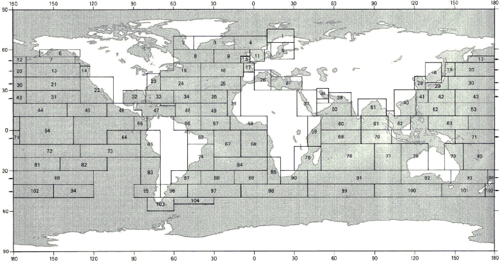

# Spektralni opis stanja mora

## Spektri valova

**Spektar valova (e: *wave spectrum*)**, odnosno funkcija spektralne gustoće, predstavlja matematičku raspodjelu valne energije (točnije, varijance izdizanja površine mora) po pojedinim frekvencijama valova u stacionarnom stanju mora. Mjerna jedinica spektralne gustoće obično je $m^2s$ (ili $m^2/Hz$).

Postoji niz standardiziranih idealiziranih spektara, a za analizu brodskih i pomorskih konstrukcija najrelevantniji su **Pierson–Moskowitz (PM),** odnosno njegova dvoparametarska modifikacija poznata kao Bretschneiderov/**ITTC** spektar, te **JONSWAP** spektar. To su jednosmjerni spektri (e: *uni-directional spectra*), što znači da se radi o jednodimenzionalnim spektrima s jednim vrhom (e: *single-peaked spectra*), kod kojih nije uključen utjecaj širenja energije valova u raznim smjerovima.

### Pierson-Moskowitz (PM) spektar

PM spektar valova koristi se za opisivanje **potpuno razvijenog mora (e: *fully developed sea*)**, karakteristično za velika oceanska prostranstva gdje vjetar puše dugo i bez ograničenja privjetrišta. Njegov standardni dvoparametarski ITTC oblik (ovisan o značajnoj visini i periodu) zadan je izrazom:

$$
S_{PM}(\omega)=\frac{5}{16}\cdot H_{S}^{2}\omega_{p}^{4}\cdot\omega^{-5}\exp\left(-\frac{5}{4}\left(\frac{\omega}{\omega_{p}}\right)^{-4}\right)
$${#eq-pm-spektar}

gdje je:

- $S_{PM}(\omega)$ -- spektralna gustoća energije valova
- $\omega$ -- kružna frekvencija valova u $rad/s$
- $H_S$ -- značajna visina vala (e: *significant wave height*) u metrima
- $\omega_p = 2\pi / T_P$ -- spektralna vršna frekvencija (e: *peak frequency*), gdje je $T_P$ vršni period vala.

Kao što je vidljivo iz jednadžbe, oblik "repa" spektra pri višim frekvencijama opada razmjerno s $\omega^{-5}$, što je fizikalna karakteristika gravitacijskih valova u ravnoteži.

::: {#fig-spektri-stanja-mora}
```{=html}
<div id="pm-widget" style="font-family: -apple-system, BlinkMacSystemFont, 'Segoe UI', Roboto, sans-serif; border: 1px solid #ddd; border-radius: 8px; padding: 20px; background: #fff; box-shadow: 0 4px 6px rgba(0,0,0,0.05); margin: 20px 0;">
    <h4 style="margin-top: 0; color: #333; margin-bottom: 15px;">Pierson-Moskowitz spektri valova</h4>
    
    <div style="display: flex; gap: 20px; margin-bottom: 15px; flex-wrap: wrap; background: #f8f9fa; padding: 15px; border-radius: 6px;">
        <div style="flex: 1; min-width: 200px;">
            <label style="font-weight: bold; font-size: 14px;">Značajna visina vala, <span style="font-style: italic;">H<sub>S</sub></span>: <span id="val-Hs" style="color: #212529;">4.0</span> m</label><br>
            <input type="range" id="slider-Hs" min="0.5" max="10" value="4.0" step="0.1" style="width: 100%;">
        </div>
        <div style="flex: 1; min-width: 200px;">
            <label style="font-weight: bold; font-size: 14px;">Vršni period, <span style="font-style: italic;">T<sub>P</sub></span>: <span id="val-Tp" style="color: #212529;">10.0</span> s</label><br>
            <input type="range" id="slider-Tp" min="3.0" max="20.0" value="10.0" step="0.1" style="width: 100%;">
        </div>
    </div>

    <div style="position: relative; width: 100%; padding-top: 50%; min-height: 400px;">
        <canvas id="pm-canvas" style="position: absolute; top: 0; left: 0; width: 100%; height: 100%;"></canvas>
    </div>
    
    <div id="pm-legend" style="display: flex; flex-wrap: wrap; gap: 15px; margin-top: 15px; font-size: 13px; justify-content: center;">
        </div>
</div>

<script>
(function() {
    const canvas = document.getElementById('pm-canvas');
    const ctx = canvas.getContext('2d');
    
    const sldHs = document.getElementById('slider-Hs');
    const sldTp = document.getElementById('slider-Tp');
    const valHs = document.getElementById('val-Hs');
    const valTp = document.getElementById('val-Tp');
    const legendContainer = document.getElementById('pm-legend');

    const seaStates = [
        { label: "SS 3 (Hs=1.0m, Tp=5.5s)", Hs: 1.0, Tp: 5.5, color: "#1f77b4" },
        { label: "SS 4 (Hs=2.0m, Tp=7.5s)", Hs: 2.0, Tp: 7.5, color: "#ff7f0e" },
        { label: "SS 5 (Hs=3.0m, Tp=9.0s)", Hs: 3.0, Tp: 9.0, color: "#2ca02c" },
        { label: "SS 6 (Hs=5.0m, Tp=12.0s)", Hs: 5.0, Tp: 12.0, color: "#d62728" },
        { label: "SS 7 (Hs=7.5m, Tp=15.0s)", Hs: 7.5, Tp: 15.0, color: "#9467bd" }
    ];

    // Build Legend
    let legendHTML = seaStates.map(ss => 
        `<div style="display: flex; align-items: center; gap: 5px;"><div style="width: 15px; height: 3px; background: ${ss.color};"></div>${ss.label}</div>`
    ).join('');
    legendHTML += `<div style="display: flex; align-items: center; gap: 5px; font-weight: bold;"><div style="width: 15px; height: 4px; background: #000; border-top: 2px dashed #000;"></div>Prilagođeni spektar (Vidi klizače)</div>`;
    legendContainer.innerHTML = legendHTML;

    function resizeCanvas() {
        const rect = canvas.parentElement.getBoundingClientRect();
        // High DPI displays support
        const dpr = window.devicePixelRatio || 1;
        canvas.width = rect.width * dpr;
        canvas.height = rect.height * dpr;
        ctx.scale(dpr, dpr);
        canvas.style.width = rect.width + 'px';
        canvas.style.height = rect.height + 'px';
        draw();
    }
    
    window.addEventListener('resize', resizeCanvas);

    function pmSpectrum(w, Hs, Tp) {
        if (w <= 0) return 0;
        const wp = 2 * Math.PI / Tp;
        return (5/16) * Math.pow(Hs, 2) * Math.pow(wp, 4) * Math.pow(w, -5) * Math.exp(-1.25 * Math.pow(w / wp, -4));
    }

    function draw() {
        const customHs = parseFloat(sldHs.value);
        const customTp = parseFloat(sldTp.value);
        valHs.textContent = customHs.toFixed(1);
        valTp.textContent = customTp.toFixed(1);

        const width = canvas.width / (window.devicePixelRatio || 1);
        const height = canvas.height / (window.devicePixelRatio || 1);
        ctx.clearRect(0, 0, width, height);

        // Padding
        const pLeft = 60, pRight = 20, pTop = 20, pBottom = 50;
        const wChart = width - pLeft - pRight;
        const hChart = height - pTop - pBottom;

        // X Axis: 0 to 2.5
        const xMax = 2.5;
        // Y Axis: Dynamic based on max value to always fit neatly
        let maxY = 15; // default max
        let maxCustomS = 0;
        
        // Find max of custom curve to auto-scale Y if needed
        for (let w = 0.1; w <= xMax; w += 0.05) {
            maxCustomS = Math.max(maxCustomS, pmSpectrum(w, customHs, customTp));
        }
        if (maxCustomS > 13) maxY = Math.ceil(maxCustomS * 1.1);

        function getX(w) { return pLeft + (w / xMax) * wChart; }
        function getY(s) { return pTop + hChart - (s / maxY) * hChart; }

        // Draw Grid
        ctx.strokeStyle = "#e9ecef";
        ctx.lineWidth = 1;
        ctx.beginPath();
        for (let i = 0; i <= xMax; i += 0.5) {
            ctx.moveTo(getX(i), pTop); ctx.lineTo(getX(i), pTop + hChart);
        }
        for (let i = 0; i <= maxY; i += Math.ceil(maxY/6)) {
            ctx.moveTo(pLeft, getY(i)); ctx.lineTo(pLeft + wChart, getY(i));
        }
        ctx.stroke();

        // Draw Axes
        ctx.strokeStyle = "#495057";
        ctx.lineWidth = 1.5;
        ctx.beginPath();
        ctx.moveTo(pLeft, pTop); ctx.lineTo(pLeft, pTop + hChart); // Y axis
        ctx.lineTo(pLeft + wChart, pTop + hChart); // X axis
        ctx.stroke();

        // Labels
        ctx.fillStyle = "#495057";
        ctx.font = "12px sans-serif";
        ctx.textAlign = "center";
        ctx.textBaseline = "top";
        for (let i = 0; i <= xMax; i += 0.5) {
            ctx.fillText(i.toFixed(1), getX(i), pTop + hChart + 8);
        }
        ctx.fillText("Kružna frekvencija, ω (rad/s)", pLeft + wChart/2, pTop + hChart + 30);

        ctx.textAlign = "right";
        ctx.textBaseline = "middle";
        for (let i = 0; i <= maxY; i += Math.ceil(maxY/6)) {
            ctx.fillText(i, pLeft - 8, getY(i));
        }
        ctx.save();
        ctx.translate(pLeft - 40, pTop + hChart/2);
        ctx.rotate(-Math.PI/2);
        ctx.textAlign = "center";
        ctx.fillText("Spektralna gustoća, S(ω) (m²s)", 0, 0);
        ctx.restore();

        // Draw Sea States
        const step = 0.02;
        seaStates.forEach(ss => {
            ctx.beginPath();
            ctx.strokeStyle = ss.color;
            ctx.lineWidth = 2;
            for (let w = 0.1; w <= xMax; w += step) {
                const s = pmSpectrum(w, ss.Hs, ss.Tp);
                if (w === 0.1) ctx.moveTo(getX(w), getY(s));
                else ctx.lineTo(getX(w), getY(s));
            }
            ctx.stroke();
        });

        // Draw Custom Spectrum
        ctx.beginPath();
        ctx.strokeStyle = "#212529";
        ctx.lineWidth = 3;
        ctx.setLineDash([8, 4]); // Dashed line for clarity
        for (let w = 0.1; w <= xMax; w += step) {
            const s = pmSpectrum(w, customHs, customTp);
            if (w === 0.1) ctx.moveTo(getX(w), getY(s));
            else ctx.lineTo(getX(w), getY(s));
        }
        ctx.stroke();
        ctx.setLineDash([]); // reset
    }

    sldHs.addEventListener('input', draw);
    sldTp.addEventListener('input', draw);
    
    // Initial draw
    setTimeout(resizeCanvas, 100);
})();
</script>
```

Pierson-Moskowitz spektri valova za tipična stanja mora.
:::

### JONSWAP spektar

JONSWAP (*Joint North Sea Wave Project*) valni spektar formuliran je kao empirijska modifikacija PM spektra. On predstavlja **stanje mora u razvoju (e: *developing sea*)**, karakteristično za ograničena područja s kraćim privjetrištem, poput Sjevernog ili Jadranskog mora. Zadan je izrazom:

$$
S_{J}(\omega)=A_{\gamma}S_{PM}(\omega)\gamma^{\exp\left(-0.5\left(\frac{\omega-\omega_{p}}{\sigma\omega_{p}}\right)^{2}\right)}
$${#eq-jonswap-spektar}

gdje su dodatni parametri:

- $\gamma$ -- bezdimenzionalni parametar vršnog pojačanja (e: *peak enhancement factor*), koji obično iznosi od 1 do 7 (prosjek $\gamma = 3.3$).
- $\sigma$ -- parametar širine spektra (e: *spectral width parameter*), koji iznosi $\sigma = 0.07$ za $\omega \le \omega_p$, te $\sigma = 0.09$ za $\omega > \omega_p$.
- $A_\gamma = 1 - 0.287 \ln \gamma$ -- faktor normiranja (e: *normalization factor*) koji osigurava da ukupna energija spektra (površina ispod krivulje) ostane konzistentna sa zadanom značajnom visinom $H_S$.

Prema izrazu gore, JONSWAP skalira PM spektar. Za slučaj kada je $\gamma = 1$, JONSWAP spektar se u potpunosti reducira u PM spektar. JONSWAP spektar daje fizikalno realne rezultate u inženjerskim proračunima samo ako parametri zadovoljavaju granice strmine vala, obično kada vrijedi:

$$3.6 < \frac{T_P}{\sqrt{H_S}} < 5$$

Na priloženom grafu zorno je prikazano kako parametar $\gamma > 1$ drastično pojačava i izoštrava vrh (e: *spectral peak*) JONSWAP spektra u odnosu na ravniji i širi Pierson-Moskowitz spektar ($\gamma = 1$) za iste ulazne vrijednosti ($H_S = 4.0\text{ m}$, $T_P = 8.0\text{ s}$). Zbog ove oštrine, brodovi projektirani za oceansku plovidbu (PM spektar) ponekad mogu doživjeti snažniju rezonanciju i opasnija kretanja u zatvorenim morima (JONSWAP spektar) ako im se prirodna frekvencija poklopi s uskim vrhom spektra.

{#fig-jonswap-spektar width="70%"}

### Jadransko more kao primjer zatvorenog mora

Jadransko more je tipičan primjer **mora ograničenog privjetrištem** (e: *fetch-limited sea*). Najveće privjetrište iznosi oko 800 km duž osi sjeverozapad--jugoistok, dok je poprečno privjetrište znatno kraće (150--200 km). Zbog toga se valovi na Jadranu razvijaju pod utjecajem dva dominantna vjetra:

- **Bura (NE):** Puše okomito na istočnu obalu s vrlo kratkim privjetrištem. Stvara kratke, strme valove visokih frekvencija. Značajna visina rijetko prelazi $H_S = 3$--$4$ m, a periodi su kratki ($T_P = 4$--$6$ s). Za opis bure najprikladniji je JONSWAP spektar s visokim $\gamma$ (4--7).
- **Jugo (SE):** Puše duž osi Jadrana s mnogo većim privjetrištem. Može razviti veće valove ($H_S$ do 5--6 m u ekstremnim slučajevima) s duljim periodima ($T_P = 7$--$10$ s). JONSWAP spektar sa $\gamma = 2$--$4$ dobro opisuje ove uvjete.

Usporedba s otvorenim oceanom (Sjeverni Atlantik) gdje $H_S$ rutinski doseže 8--12 m s periodima $T_P = 12$--$18$ s jasno pokazuje ograničenja zatvorenih mora.

## Dijagram raspršenja

Za opis dugoročne klime valova na nekom geografskom području koristi se **dijagram raspršenja (e: *wave scatter diagram*)**. On definira statističku vjerojatnost pojave (ili učestalost pojavljivanja) različitih stacionarnih stanja mora tijekom dužeg vremenskog perioda (npr. jedne godine ili cijelog životnog vijeka broda).

Svako pojedino stanje mora u dijagramu definirano je kombinacijom dva parametra: **značajnom visinom valova (**$H_S$**)** na jednoj osi i **nultim periodom (**$T_Z$**)** (ili vršnim periodom $T_P$) na drugoj osi. Dijagram je zapravo dvodimenzionalna tablica (matrica) u kojoj svaki broj predstavlja koliko se puta određena kombinacija visine i perioda vala pojavila na svakih 100,000 ili 1,000,000 promatranja.

Na slici je prikazan važan referentni dijagram raspršenja (definiran kroz IACS Rec. 34), koji predstavlja najgrublje uvjete plovidbe i koristi se kao standard za proračun ekstremnih globalnih opterećenja brodskog trupa i procjenu zamora materijala.

{#fig-dijagram-rasprsenja width="70%"}


Oceani su podijeljeni u specifične **nautičke zone** (e: *nautical zones / wave areas*) prema *Global Wave Statistics*, a za svaku zonu postoji pripadajući dijagram raspršenja. Kombiniranjem dijagrama iz zona kroz koje brod planira ploviti, dobiva se operativni profil specifičan za taj projekt.

{#fig-nauticke-zone width="70%"}


## Kratkoročna statistika slučajnog stanja mora

Dok spektar valova daje raspodjelu energije po frekvencijama, **vjerojatnosni ili probabilistički pristup** analizira statističku raspodjelu samih kinematičkih veličina (elevacija, amplituda, visina) u kratkom vremenskom prozoru (npr. 3 sata), ne uzimajući u obzir redoslijed kojim se te vrijednosti pojavljuju u vremenu.

### Gaussova razdioba za elevaciju površine

Osnovna je pretpostavka da je izdizanje morske površine, $\eta(t)$, stacionaran slučajan proces distribuiran po zakonu **Gaussove funkcije gustoće vjerojatnosti (e: *Gaussian probability density function - PDF*)** s nultom srednjom vrijednosti (razina mirnog mora). To je moguće jer se uzburkano more sastoji od beskonačnog broja harmonika sa slučajnim faznim pomacima.

Funkcija gustoće vjerojatnosti, $f(\eta)$, koja opisuje vjerojatnost da izdizanje mora poprimi određenu vrijednost glasi:

$$f(\eta) = \frac{1}{\sqrt{2\pi m_0}} \exp\left(-\frac{\eta^2}{2m_0}\right)$$

gdje je $m_0$ **nulti spektralni moment** tj. ukupna površina ispod krivulje spektra. Iz ove jednadžbe proizlazi ključna veza spektralne i statističke analize: $m_0$ je jednak **varijanci** slučajnog procesa $\eta(t)$.

::: {#fig-gaussova-razdioba}
```{=html}
<div id="gaussian-widget" style="font-family: -apple-system, BlinkMacSystemFont, 'Segoe UI', Roboto, sans-serif; border: 1px solid #ddd; border-radius: 8px; padding: 20px; background: #fff; box-shadow: 0 4px 6px rgba(0,0,0,0.05); margin: 20px 0;">
    <h4 style="margin-top: 0; color: #333; margin-bottom: 15px;">Gaussova razdioba elevacije površine</h4>
    
    <div style="display: flex; gap: 20px; margin-bottom: 15px; flex-wrap: wrap; background: #f8f9fa; padding: 15px; border-radius: 6px;">
        <div style="flex: 1; min-width: 200px;">
            <label style="font-weight: bold; font-size: 14px;">Značajna visina vala, <span style="font-style: italic;">H<sub>S</sub></span>: <span id="val-Hs-gauss" style="color: #212529;">4.0</span> m</label><br>
            <input type="range" id="slider-Hs-gauss" min="0.5" max="12" value="4.0" step="0.1" style="width: 100%;">
        </div>
        <div style="flex: 1; min-width: 200px; font-size: 13px; color: #495057;">
            <div>Varijanca (m₀ = σ²): <span id="val-m0" style="font-weight: bold;">0.25</span> m²</div>
            <div>Standardna devijacija (σ = H<sub>S</sub>/4): <span id="val-sigma" style="font-weight: bold;">1.00</span> m</div>
        </div>
    </div>

    <div style="position: relative; width: 100%; padding-top: 40%; min-height: 300px;">
        <canvas id="gauss-canvas" style="position: absolute; top: 0; left: 0; width: 100%; height: 100%;"></canvas>
    </div>
</div>

<script>
(function() {
    const canvas = document.getElementById('gauss-canvas');
    const ctx = canvas.getContext('2d');
    const sldHs = document.getElementById('slider-Hs-gauss');
    const dispHs = document.getElementById('val-Hs-gauss');
    const dispM0 = document.getElementById('val-m0');
    const dispSigma = document.getElementById('val-sigma');

    function resizeCanvas() {
        const rect = canvas.parentElement.getBoundingClientRect();
        const dpr = window.devicePixelRatio || 1;
        canvas.width = rect.width * dpr;
        canvas.height = rect.height * dpr;
        ctx.scale(dpr, dpr);
        canvas.style.width = rect.width + 'px';
        canvas.style.height = rect.height + 'px';
        draw();
    }
    
    window.addEventListener('resize', resizeCanvas);

    function gaussianPDF(x, sigma) {
        return (1 / (sigma * Math.sqrt(2 * Math.PI))) * Math.exp(-0.5 * Math.pow(x / sigma, 2));
    }

    function draw() {
        const Hs = parseFloat(sldHs.value);
        const sigma = Hs / 4;
        const m0 = Math.pow(sigma, 2);

        dispHs.textContent = Hs.toFixed(1);
        dispM0.textContent = m0.toFixed(3);
        dispSigma.textContent = sigma.toFixed(2);

        const width = canvas.width / (window.devicePixelRatio || 1);
        const height = canvas.height / (window.devicePixelRatio || 1);
        ctx.clearRect(0, 0, width, height);

        const pLeft = 60, pRight = 20, pTop = 20, pBottom = 50;
        const wChart = width - pLeft - pRight;
        const hChart = height - pTop - pBottom;

        // X axis range based on Hs
        const xLimit = Math.max(4, Hs);
        const xMin = -xLimit, xMax = xLimit;
        
        // Y axis max (peak of PDF is 1/(sigma*sqrt(2pi)))
        const peak = 1 / (sigma * Math.sqrt(2 * Math.PI));
        const yMax = Math.max(0.8, peak * 1.1);

        function getX(x) { return pLeft + ((x - xMin) / (xMax - xMin)) * wChart; }
        function getY(y) { return pTop + hChart - (y / yMax) * hChart; }

        // Grid
        ctx.strokeStyle = "#e9ecef";
        ctx.lineWidth = 1;
        ctx.beginPath();
        for (let x = Math.ceil(xMin); x <= Math.floor(xMax); x++) {
            ctx.moveTo(getX(x), pTop); ctx.lineTo(getX(x), pTop + hChart);
        }
        ctx.stroke();

        // Axes
        ctx.strokeStyle = "#495057";
        ctx.lineWidth = 1.5;
        ctx.beginPath();
        ctx.moveTo(pLeft, pTop); ctx.lineTo(pLeft, pTop + hChart);
        ctx.lineTo(pLeft + wChart, pTop + hChart);
        ctx.stroke();

        // Labels
        ctx.fillStyle = "#495057";
        ctx.font = "12px sans-serif";
        ctx.textAlign = "center";
        for (let x = Math.ceil(xMin); x <= Math.floor(xMax); x++) {
            if (x % 2 === 0 || Hs < 5) {
                ctx.fillText(x, getX(x), pTop + hChart + 18);
            }
        }
        ctx.fillText("Elevacija površine, η (m)", pLeft + wChart/2, pTop + hChart + 35);

        ctx.textAlign = "right";
        ctx.textBaseline = "middle";
        for (let y = 0; y <= yMax; y += 0.2) {
            ctx.fillText(y.toFixed(1), pLeft - 10, getY(y));
        }

        // 1-sigma shaded area
        ctx.fillStyle = "rgba(13, 110, 253, 0.1)";
        ctx.beginPath();
        ctx.moveTo(getX(-sigma), getY(0));
        for (let x = -sigma; x <= sigma; x += sigma/20) {
            ctx.lineTo(getX(x), getY(gaussianPDF(x, sigma)));
        }
        ctx.lineTo(getX(sigma), getY(0));
        ctx.fill();

        // PDF Curve
        ctx.beginPath();
        ctx.strokeStyle = "#0d6efd";
        ctx.lineWidth = 3;
        const step = (xMax - xMin) / 200;
        for (let x = xMin; x <= xMax; x += step) {
            const y = gaussianPDF(x, sigma);
            if (x === xMin) ctx.moveTo(getX(x), getY(y));
            else ctx.lineTo(getX(x), getY(y));
        }
        ctx.stroke();
    }

    sldHs.addEventListener('input', draw);
    setTimeout(resizeCanvas, 100);
})();
</script>
```

Gaussova razdioba vjerojatnosti za različite značajne visine valova.
:::


### Rayleighova razdioba za amplitude i visine valova

Dok se sama površina mora ponaša po Gaussovom zakonu, za statistički opis **amplituda valova (**$a$**)** i **valnih visina (**$H$**)** godinama se uspješno koristi **Rayleighova razdioba (e: *Rayleigh distribution*)**. Da bi se Rayleighova razdioba mogla primijeniti, uvodi se pretpostavka o **uskopojasnom procesu (e: *narrow-band process*)**. To znači da su valne frekvencije grupirane blizu jedne dominantne frekvencije. U tom slučaju, valna visina može se aproksimirati kao dvostruka amplituda, tj. $H = 2a$.

Općeniti izraz za funkciju gustoće vjerojatnosti Rayleighove razdiobe za **amplitude valova (**$a$**)** glasi:

$$f(a) = \frac{a}{m_0} \exp\left(-\frac{a^2}{2m_0}\right)$$

Supstitucijom $a = H/2$, dobivamo inženjerima najvažniju funkciju gustoće vjerojatnosti za **visine valova (**$H$**)**:

$$f(H) = \frac{H}{4m_0} \exp\left(-\frac{H^2}{8m_0}\right)$$

::: {#fig-rayleighova-razdioba}
```{=html}
<div id="rayleigh-widget" style="font-family: -apple-system, BlinkMacSystemFont, 'Segoe UI', Roboto, sans-serif; border: 1px solid #ddd; border-radius: 8px; padding: 20px; background: #fff; box-shadow: 0 4px 6px rgba(0,0,0,0.05); margin: 20px 0;">
    <h4 style="margin-top: 0; color: #333; margin-bottom: 15px;">Rayleighova razdioba amplituda i visina</h4>
    
    <div style="display: flex; gap: 20px; margin-bottom: 15px; flex-wrap: wrap; background: #f8f9fa; padding: 15px; border-radius: 6px;">
        <div style="flex: 1; min-width: 200px;">
            <label style="font-weight: bold; font-size: 14px;">Značajna visina vala, <span style="font-style: italic;">H<sub>S</sub></span>: <span id="val-Hs-rayleigh" style="color: #212529;">4.0</span> m</label><br>
            <input type="range" id="slider-Hs-rayleigh" min="0.5" max="12" value="4.0" step="0.1" style="width: 100%;">
        </div>
        <div style="flex: 1; min-width: 250px; font-size: 13px; color: #495057; display: flex; flex-direction: column; justify-content: center;">
            <div style="display: flex; align-items: center; gap: 8px;"><div style="width: 15px; height: 3px; background: #198754;"></div> PDF za amplitude, f(a)</div>
            <div style="display: flex; align-items: center; gap: 8px;"><div style="width: 15px; height: 3px; background: #dc3545;"></div> PDF za visine, f(H)</div>
        </div>
    </div>

    <div style="position: relative; width: 100%; padding-top: 40%; min-height: 300px;">
        <canvas id="rayleigh-canvas" style="position: absolute; top: 0; left: 0; width: 100%; height: 100%;"></canvas>
    </div>
</div>

<script>
(function() {
    const canvas = document.getElementById('rayleigh-canvas');
    const ctx = canvas.getContext('2d');
    const sldHs = document.getElementById('slider-Hs-rayleigh');
    const dispHs = document.getElementById('val-Hs-rayleigh');

    function resizeCanvas() {
        const rect = canvas.parentElement.getBoundingClientRect();
        const dpr = window.devicePixelRatio || 1;
        canvas.width = rect.width * dpr;
        canvas.height = rect.height * dpr;
        ctx.scale(dpr, dpr);
        canvas.style.width = rect.width + 'px';
        canvas.style.height = rect.height + 'px';
        draw();
    }
    
    window.addEventListener('resize', resizeCanvas);

    function rayleighPDF_a(a, m0) {
        if (a < 0) return 0;
        return (a / m0) * Math.exp(-Math.pow(a, 2) / (2 * m0));
    }

    function rayleighPDF_H(H, m0) {
        if (H < 0) return 0;
        return (H / (4 * m0)) * Math.exp(-Math.pow(H, 2) / (8 * m0));
    }

    function draw() {
        const Hs = parseFloat(sldHs.value);
        const m0 = Math.pow(Hs / 4, 2);
        dispHs.textContent = Hs.toFixed(1);

        const width = canvas.width / (window.devicePixelRatio || 1);
        const height = canvas.height / (window.devicePixelRatio || 1);
        ctx.clearRect(0, 0, width, height);

        const pLeft = 60, pRight = 20, pTop = 20, pBottom = 50;
        const wChart = width - pLeft - pRight;
        const hChart = height - pTop - pBottom;

        const xMax = Hs * 2.5;
        // Peak of Rayleigh for a is at sqrt(m0), value is 1/sqrt(m0*e)
        // Peak for H is at 2*sqrt(m0), value is 1/(2*sqrt(m0*e))
        const peakVal_a = 1 / (Math.sqrt(m0 * Math.E));
        const yMax = Math.max(0.6, peakVal_a * 1.1);

        function getX(x) { return pLeft + (x / xMax) * wChart; }
        function getY(y) { return pTop + hChart - (y / yMax) * hChart; }

        // Grid
        ctx.strokeStyle = "#e9ecef";
        ctx.lineWidth = 1;
        ctx.beginPath();
        for (let x = 0; x <= xMax; x += Hs/2) {
            ctx.moveTo(getX(x), pTop); ctx.lineTo(getX(x), pTop + hChart);
        }
        ctx.stroke();

        // Axes
        ctx.strokeStyle = "#495057";
        ctx.lineWidth = 1.5;
        ctx.beginPath();
        ctx.moveTo(pLeft, pTop); ctx.lineTo(pLeft, pTop + hChart);
        ctx.lineTo(pLeft + wChart, pTop + hChart);
        ctx.stroke();

        // Labels
        ctx.fillStyle = "#495057";
        ctx.font = "12px sans-serif";
        ctx.textAlign = "center";
        for (let x = 0; x <= xMax; x += Hs/2) {
            ctx.fillText(x.toFixed(1), getX(x), pTop + hChart + 18);
        }
        ctx.fillText("Vrijednost (a ili H) [m]", pLeft + wChart/2, pTop + hChart + 35);

        ctx.textAlign = "right";
        ctx.textBaseline = "middle";
        for (let y = 0; y <= yMax; y += 0.2) {
            ctx.fillText(y.toFixed(1), pLeft - 10, getY(y));
        }

        // PDF Curve for a
        ctx.beginPath();
        ctx.strokeStyle = "#198754";
        ctx.lineWidth = 2.5;
        for (let x = 0; x <= xMax; x += xMax/200) {
            const y = rayleighPDF_a(x, m0);
            if (x === 0) ctx.moveTo(getX(x), getY(y));
            else ctx.lineTo(getX(x), getY(y));
        }
        ctx.stroke();

        // PDF Curve for H
        ctx.beginPath();
        ctx.strokeStyle = "#dc3545";
        ctx.lineWidth = 2.5;
        for (let x = 0; x <= xMax; x += xMax/200) {
            const y = rayleighPDF_H(x, m0);
            if (x === 0) ctx.moveTo(getX(x), getY(y));
            else ctx.lineTo(getX(x), getY(y));
        }
        ctx.stroke();
    }

    sldHs.addEventListener('input', draw);
    setTimeout(resizeCanvas, 100);
})();
</script>
```

Usporedba Rayleighovih razdioba za amplitude i visine valova.
:::

Iz integracije ove Rayleighove razdiobe proizlazi najslavnija i najkorisnija formula u pomorstvenosti, koja direktno povezuje statistiku valova s valnim spektrom, a to je izraz za **značajnu visinu vala (**$H_S$**)**:

$$H_S \approx 4\sqrt{m_0}$$
