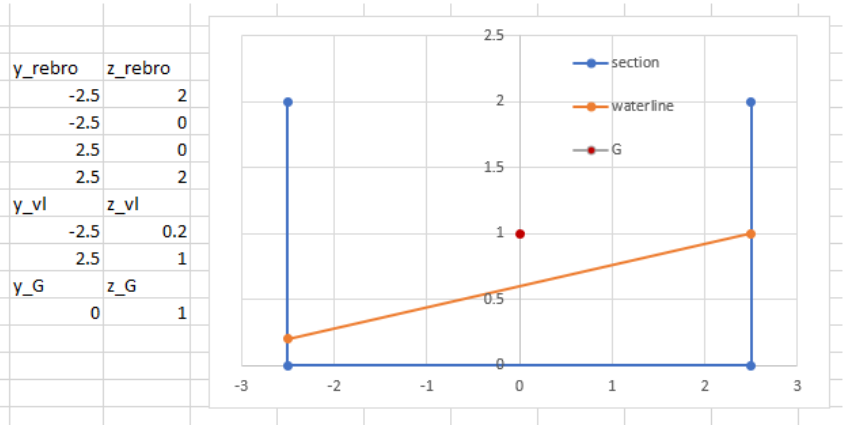
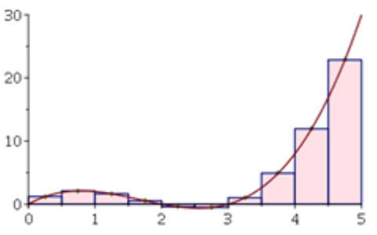
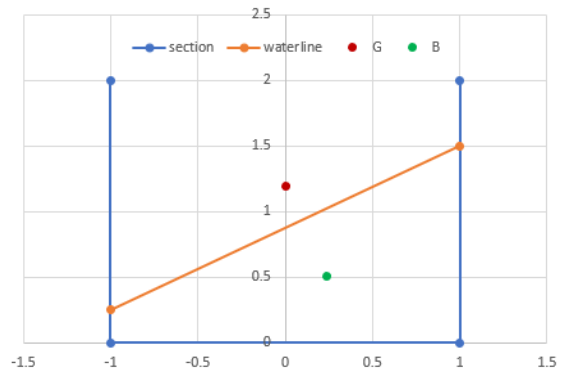

## Koraci

1. Otvoriti *MS Excel*
2. Definirati ulazne parametre – izmjere pontona: 
   1. Duljina pontona, *L* (m) 
   2. Širina pontona, *B* (m) 
   3. Visina pontona, *D* (m) 
   4. Visina težišta od kobilice, *KG* (m) 
3. Definirati ulazne parametre – nagib pontona preko gaza na lijevoj i desnoj strani: 
   1. Gaz na lijevoj strani, *TP* (m) 
   2. Gaz na desnoj strani, *TS* (m) 
   3. Poprečni kut nagiba pontona se izračuna: $θ=tan^{−1}(\frac{T_S−T_P}{B})$
4. Nacrtati presjek (generirati točke te *Insert* > *Charts* > *Scatter with straight lines*) 
   1. Teoretsko rebro je određeno linijama koje povezuju točke: 
      1. Gornja lijeva {-*B*/2, *D*} 
      2. Donja lijeva {-*B*/2, 0 } 
      3. Donja desna {*B*/2, 0 } 
      4. Gornja desna {*B*/2, *D*} 
   2. Vodna linija je određena linijom između točaka: 
      1. Lijeva {-*B*/2, *TP*} 
      2. Desna {*B*/2, *TS*} 
   3. Težište mase (G) ucrtati u točki {0, *KG*}
5. Numerički integrirati uronjeni presjek tj. gazove (od lijeve prema desnoj strani):
   1. Izabrati broj dijelova integrala, tj. sume, *N* (npr. 20) 
   2. Odrediti širinu integracijskog koraka, *dY* = *B* / *N* 
   3. Izraditi integracijsku tablicu s $N$ redova prema sljedećem predlošku:

| **Korak (i)** | **Poluširina (Yi)** | **Gaz trake (Ti)** | **Površina (dAi)** | **Horiz. moment (dAi⋅Yi)** | **Vert. moment (dAi⋅Ti/2)** |
|---|---|---|---|---|---|
| 1 | $-B/2 + dY \cdot (1 - 0.5)$ | $T_P + (T_S - T_P) \cdot \frac{1 - 0.5}{N}$ | $T_1 \cdot dY$ | $dA_1 \cdot Y_1$ | $dA_1 \cdot (T_1 / 2)$ |
| ... | ... | ... | ... | ... | ... |
| i | $-B/2 + dY \cdot (i - 0.5)$ | $T_P + (T_S - T_P) \cdot \frac{i - 0.5}{N}$ | $T_i \cdot dY$ | $dA_i \cdot Y_i$ | $dA_i \cdot (T_i / 2)$ |
| ... | ... | ... | ... | ... | ... |
| $N$ | $-B/2 + dY \cdot (N - 0.5)$ | $T_P + (T_S - T_P) \cdot \frac{N - 0.5}{N}$ | $T_N \cdot dY$ | $dA_N \cdot Y_N$ | $dA_N \cdot (T_N / 2)$ |

6. Proračun istisnine i težišta (zbrajanjem stupaca iz tablice): 
   1. Uronjena površinu presjeka, $A=∫T(Y)dY=∑T_i dY=∑dA_i$
   2. Poluširina težišta presjeka tj. istisnine, $y_B=∑(dA_i Y_i)/A$
   3. Visina težišta presjeka, tj. istisnine, $z_B=∑(dA_i T_i/2)/A$
   4. Volumen istisnine pontona,$∇=AL$, a masa istisnine $Δ =∇ ρ$ (gdje je gustoća vode, npr. $1.025 \text{ t/m}^3$)

{#fig-pq7GxVrNAL width="60%"}

{#fig-KzqSNr3ZwB width="30%"}

{#fig-Q6r5FUHdvN width="50%"}

## Dodatni zadatak

Ako je poznat kut nagiba $\theta$, te koordinate težišta uzgona $B(y_B, z_B)$ i težišta mase $G(0, KG)$, potrebno je odrediti $GZ$ polugu statičkog stabiliteta koristeći geometrijsku transformaciju.
