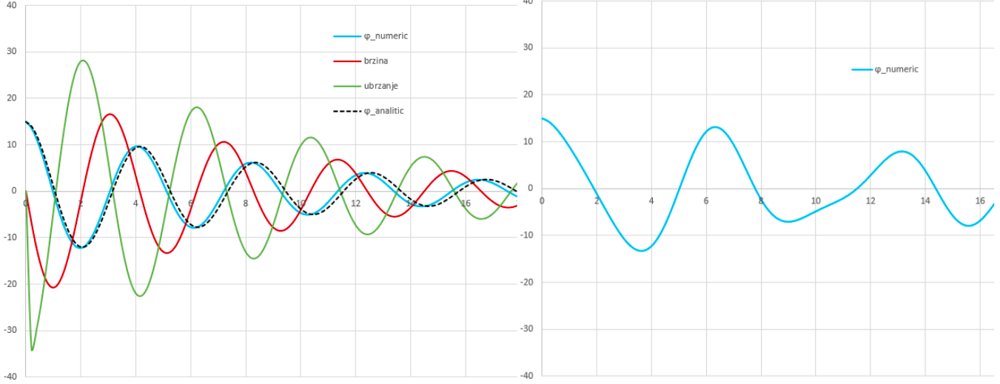

**Cilj vježbe:** Korištenjem MS Excela odrediti prirodnu frekvenciju ljuljanja broda te primjenom numeričke integracije (Eulerova metoda) simulirati slobodno prigušeno ljuljanje u vremenu. Na kraju, rezultate usporediti s analitičkim rješenjem.

## Određivanje prirodne frekvencije ljuljanja

Otvorite MS Excel i u prvi dio radnog lista unesite ulazne parametre i konstante:

1. Definirati ulazne parametre: 
   1. Širina broda, *B* (m) 
   2. Istisnina, Δ (kg) 
   3. Poprečna metacentarska visina, *GMT* (m) 
2. Definirati konstante: 
   1. Gravitacijska konstanta, *g* = 9.81 m/s^2 
   2. Koeficijent polumjera vrtnje, *a* = 0.37 
   3. Koeficijent dodatne mase, κ = 0.2 

Izračunajte sljedeće vrijednosti u Excelu:

- Povratna krutost, $C_{44}=g \Delta GMT$
- Polumjer inercije mase, $R_{44}=a B$
- Moment tromosti oko uzdužne osi *x*, $I_x= \Delta R_{44}^2$
- Dodatna masa (dodatna tromost), $A_{44}=κ I_x$

Izračunati prirodnu frekvenciju pomoću formule:

$$\omega_{roll}=\omega_0=\sqrt{\frac{C_{44}}{I_x+A_{44}}}$$

## Određivanje krivulje nagiba broda u vremenu

Cilj je numerički integrirati jednadžbu gibanja za slobodno prigušeno ljuljanje, koje je opisano diferencijalnom jednadžbom drugog reda:

$$\ddot{\phi} + 2\zeta\omega_0\dot{\phi} + \omega_0^2\phi = 0$$

### Ulazni parametri

Definirati varijabilne ulazne parametre:

- Početni nagib broda, $\phi_0$ (npr. 10°)
- Početna brzina ljuljanja, $\dot{\phi}_0$ (°/s, npr. ostaviti na 0)
- Relativno prigušenje, $\zeta$ (npr. oko 7 %)
- Integracijski korak, $\Delta t$

### Integracijska tablica

Napraviti integracijsku tablicu prema primjeru dolje, na sljedeći način:

- Kutno ubrzanje $\ddot{\phi}$ se izračuna za svaki vremenski korak prema jednadžbi gibanja (prebaciti sve osim $\ddot{\phi}$ na desnu stranu jednadžbe)
- Izračunati kutnu brzinu $\dot{\phi}(t)$ iz jednadžbe ubrzanja, tj. derivacije brzine koristeći dva prethodna koraka, $\dot{\phi}(t) \approx \frac{\phi(t) - \phi(t - \Delta t)}{\Delta t}$ (primjetite da je jedino $\dot{\phi}(t)$ u jednadžbi nepoznato).
- Pošto je kutna brzina derivacija nagiba, na sličan način dobiti nagib $\phi(t)$

| Korak, $i$ | Vrijeme, $t$ | Ubrzanje, $\ddot{\phi}$ | Brzina, $\dot{\phi}$ | Nagib, $\phi$ |
|---|---|---|---|---|
| 0 | 0 | 0 | $\dot{\phi}_0$ | $\phi_0$ |
| 1 | $\Delta t_i$ | $-2 \zeta\omega_0 \dot{\phi}_{i-1} - \omega_0^2 \phi_{i-1}$ | $\dot{\phi}_{i-1} + \ddot{\phi}_{i} \Delta t$ | $\phi_{i-1} + \dot{\phi}_{i} \Delta t$ |
| ... | ... | ... | ... | ... |
| *N* | $\Delta t_N$ | $-2 \zeta\omega_0 \dot{\phi}_{N-1} - \omega_0^2 \phi_{N-1}$ | $\dot{\phi}_{N-1} + \ddot{\phi}_{N} \Delta t$ | $\phi_{N-1} + \dot{\phi}_{N} \Delta t$ |

### Prikaz i analiza rezultata

1. Nacrtati grafove ubrzanja, brzine i pomaka (*Insert > Charts > Scatter > Scatter wih smooth lines*)
2. Mijenjati ulazne parametre ($B$, $\Delta$, $GMT$) i {u}`napisati zaključak koji objašnjava kako ljuljanje broda ovisi tim parametrima`
3. Prikazati analitičku krivulju na istom grafu u usporedbi sa numerički dobivenom krivuljom

::: {.callout-important}
Prisjetimo se: ako je početna brzina ljuljanja $\dot{\phi}_0 = 0$, analitičko rješenje jednadžbe gibanja sa malim prigušenjem ($\zeta << 1$) je: $\phi(t) = \Phi_0 e^{-\zeta\omega_0 t} \cos(\sqrt{1-\zeta^2} \omega_0 t)$
:::

{#fig-QgxwESX613 width="70%"}

## Zadatak: Prisilno ljuljanje

Kopirajte prethodni radni list. Sada je potrebno numerički integrirati jednadžbu gibanja s vanjskom uzbudom (valovima). Desna strana jednadžbe više nije nula, već je zadana funkcijom uzbudnog momenta:

$$\ddot{\phi} + 2\zeta\omega_0\dot{\phi} + \omega_0^2\phi = F(t)$$

gdje je uzbudna funkcija:

$$F(t) = \frac{\phi_0}{3} \sin(\omega_F t)$$

Kružna frekvencija uzbude $\omega_F$ neka bude jednaka jednoj petini ukupnog broja slova u vašem imenu i prezimenu.

Izmijenite formulu za ubrzanje u tablici dodavanjem ovog člana i nacrtajte novi graf.
