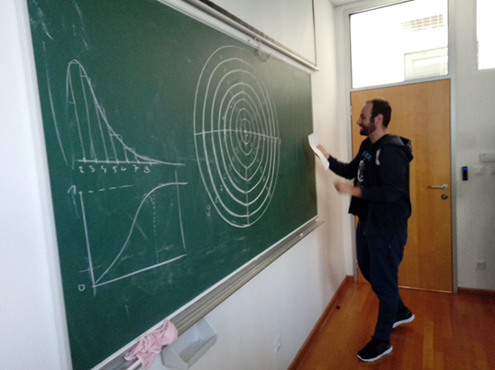

## Cilj vježbe

Kroz praktičan eksperiment prikupiti podatke o slučajnim, diskretnim događajima te na njih primijeniti statističku analizu u MS Excelu. Vježba zorno prikazuje kako se dvodimenzionalni Gaussov proces (greška gađanja) preslikava u **Rayleighovu razdiobu** (radijalna udaljenost od centra), istu razdiobu kojom u pomorstvenosti opisujemo amplitude morskih valova.

## Priprema i prikupljanje podataka

Potrebno je gađati metu (pikado, papirići ili kreda) i precizno zabilježiti događaje:

- Nacrtajte metu od osam koncentričnih kružnica na ploču. Međuprostore (prstenove) označite brojevima od 1 (centar) do 9 (vanjski rub/promašaj).
- Odmaknite se na fiksnu udaljenost od mete (npr. 1500 mm).
- Izvršite minimalno **50 pokušaja** gađanja, pritom uvijek ciljajući isključivo u sredinu mete (polje 1).
- Zabilježite svaki događaj (upišite koji je broj polja pogođen u svakom bacanju).

## Obrada podataka i histogram (MS Excel)

Sada kada imate niz od 50+ slučajnih brojeva, otvorite MS Excel:

- U jednom stupcu zbrojite frekvenciju događaja (koliko ste puta pogodili polje 1, koliko puta polje 2, itd.).
- Podijelite broj pogodaka svakog polja s ukupnim brojem bacanja kako biste dobili **relativnu frekvenciju** (empirijsku vjerojatnost).
- Označite te podatke i izradite **histogram** (Stupčasti graf / *Column chart*). Primijetit ćete da graf nije simetričan, već ima "rep" prema većim brojevima polja.

## Odabir teorijske razdiobe

Sada na naše eksperimentalne podatke moramo položiti teorijsku matematičku krivulju. Budući da ciljamo centar, a ruka nam neovisno griješi po X i Y osi, radijalna udaljenost pogotka prati **Rayleighovu razdiobu**. Funkcija gustoće vjerojatnosti ($f(x)$) za Rayleighovu razdiobu glasi:

$$f(x) = \frac{x}{\sigma^2} e^{-\frac{x^2}{2\sigma^2}}$$

gdje je:

- $x$ – radijalna udaljenost (u našem slučaju, broj polja od 1 do 9).
- $\sigma$ – parametar razdiobe koji predstavlja standardnu devijaciju greške vaše ruke.

**Kako pronaći vaš** $\sigma$**?**

Izračunajte aritmetičku sredinu ($\bar{x}$) svih vaših 50 pogodaka u Excelu (funkcija `AVERAGE`). Kod Rayleighove razdiobe postoji stroga veza između srednje vrijednosti i parametra $\sigma$:

$$\bar{x} = \sigma \sqrt{\frac{\pi}{2}} \implies \sigma \approx \frac{\bar{x}}{1.253}$$

Izračunajte svoj $\sigma$, ubacite ga u gornju formulu $f(x)$ za svako polje (1 do 9) i nacrtajte tu teorijsku krivulju preko svog histograma. Što je vaš $\sigma$ manji, to ste bolji strelac!

## Kumulativna razdioba

Kumulativna razdioba nam govori: *"Kolika je vjerojatnost da ću pogoditi polje X ili neko polje bliže centru?"*.

- U Excelu napravite novi stupac gdje ćete kumulativno zbrajati relativne frekvencije iz koraka 2 (svaki redak je zbroj tog i svih prethodnih redaka). Konačni broj mora biti 1.0 (100%).
- Nacrtajte graf.
- Analitička formula za Rayleighovu kumulativnu distribuciju (CDF) glasi: $F(x) = 1 - e^{-\frac{x^2}{2\sigma^2}}$. Nacrtajte i ovu teorijsku liniju te je usporedite sa svojim zbrojenim rezultatima!
